#Merkezi Yönetim Sistemi ile Ahtapot Kurulumları Yapılması
------

[TOC]

Bu dokümanda, Ahtapot bütünleşik güvenlik yönetim sisteminde kullanılan merkezi yönetim sunucusu ile gerekli tüm sistemlerin kurulması prosedürü anlatılıyor.

Gereken : Pardus Temel ISO’ dan kurulumu tamamlanmış sunucular.


####Ansible Kurulum İşlemleri

* **NOT:** Dökümanda yapılması istenilen değişiklikler gitlab arayüzü yerine terminal üzerinden yapılması durumunda playbook oynatılmadan önce yapılan değişiklikler git'e push edilmelidir.

```
$ cd /etc/ansible
git status komutu ile yapılan değişiklikler gözlemlenir.
$ git status  
$ git add --all
$ git commit -m "yapılan değişiklik commiti yazılır"
$ git push origin master
```
**NOT:** Kurulacak sistem, SIEM yapısına dahil edilmek isteniyorsa, kurulum sonrasında Siber Olay, Açıklık, Risk İzleme ve Yönetim Sistemi Kurulumu sayfasında bulunan [MYS Clientlarında Ossec Agent Dağıtımı](siem-kurulum.md) başlığı incelenmelidir.

* Pardus Temel ISO dosyasından Pardus kurulumu tamamlandıktan sonra sisteme “**ahtapotops**” kullanıcı ile giriş yapılır. ahtapotops kullanıcısının parolası “**LA123!!**” olarak öntanımlıdır.

**NOT :** Pardus Temel ISO dosyasından Pardus kurulumu adımları için “AHTAPOT Pardus Temel ISO Kurulumu” dokümanına bakınız.

* Sisteme giriş sağlandıktan sonra, aşağıdaki komut ile root kullanıcısına geçiş yapılır. root kullanıcısı için parola Pardus Temel ISO kurulumda belirlenmiş olan paroladır.

```
$ sudo su -
```
* Sisteme root kullanıcısı ile bağlantı sağlandıktan sonra tercih ettiğiniz bir metin düzenleyicisini kullanarak "**/etc/apt/source.list**" dosyasını açın ve Pardus depolarını kullanıyorsanız aşağıdaki satırları içerdiğinden emin olun.

```
deb http://depo.pardus.org.tr/ahtapot yenikusak main
deb http://193.140.98.199/pardus-yenikusak yenikusak main non-free contrib
```

* Eğer yeni bir paket deposu eklediniz veya çıkardıysanız aşağıdaki komutu çalıştırarak yerelinizdeki paket listesini güncelleyin.

```
# apt-get update
```

* Aşağıdaki komut ile ansible ve git kurulumları yapılır.

```
# apt-get install -y ansible
# apt-get install -y git
```

**NOT :** Ansible makinası yedekli kurulacak ise, yedek olacak makinanın üzerinde bu adım el ile yapılmalıdır.


* Bu adımda kurulum, sıkılaştırma vb. gibi işleri otomatize etmeyi sağlayan ansible playbook’ları Pardus Ahtapot reposundan indirilir. 

```
# apt-get install -y ahtapot-mys
# cp -rf /ahtapotmys/* /etc/ansible/
``` 

* Ahtapot projesi kapsamında oluşacak tüm loglar “**/var/log/ahtapot/**” dizinine yazılmaktadır. Bu dizinin sahipliğini “**ahtapotops**” kullanıcısına vermek için aşağıdaki komut çalıştırılır.

```
# chown ahtapotops:ahtapotops -R /var/log/ahtapot
```

**NOT :** Ansible makinası yedekli kurulacak ise, yedek olacak makinanın üzerinde bu adım el ile yapılmalıdır.

* Bir sonraki adımda yer alan sıkılaştırma ve kurulum işlemlerinin akabinde sistemde bulunan diğer sunucular ile iletişimin kurulmasını sağlamak adına ahtapotops kullanıcısına ait AHTAPOT CA KURULUM dokümanına uygun bir şekilde oluşturulmuş anahtalar, sunucu üzerinde ilgili yerlere kopyalama işlemi yapılmalıdır. Bu işlem için gerekli adımlar aşağıdaki gibidir;

  * ahtapotops kullanıcısı için oluşturulmuş anahtarları, sunucu üzerinde /home/ahtapotops dizinine belirlenen yöntem ile kopyalanır.

```
# su - ahtapotops
$ mkdir ~/.ssh && chmod 700 ~/.ssh
```

  * Kopyalanan anahtarların ahtapotops kullanıcısına atanması için aşağıdaki komutlar çalıştırılır.

```
$ cp /home/ahtapotops/ahtapotops /home/ahtapotops/.ssh/id_rsa  && chmod 600 /home/ahtapotops/.ssh/id_rsa
$ cp /home/ahtapotops/ahtapotops-cert.pub /home/ahtapotops/.ssh/id_rsa-cert.pub
$ cp /home/ahtapotops/ahtapotops.pub /home/ahtapotops/.ssh/id_rsa.pub
```
**NOT :** Ansible makinası yedekli kurulacak ise, yedek olacak makinanın üzerinde bu adım el ile yapılmalıdır.

* Tercih ettiğimiz metin düzenleyicisini kullanarak hosts dosyasını düzenliyoruz. Aşağıdaki örnekte vi kullanılır. Açılan dosyada [ansible] kısmı altına ansible makinesinin tam ismi (FQDN) girilir.


```
$ cd /etc/ansible/
$ sudo vi hosts
[ansible]
ansible.alan.adi
```

**NOT :** Ansible makinası yedekli kurulacak ise, yedek olacak makinanın FQDN bilgiside “**[ansible]**” bölümünün altına yazılmalıdır.

* Ansible makinesinin erişmesi gereken tüm makinelerin hosts dosyasını düzenlemek adına, "**roles/base/vars/host.yml**" dosyası içerisine tüm makine bilgileri yazılır.

```
$ sudo vi roles/base/vars/host.yml
# Sunucu degiskenlerini iceren dosyadir.
# Yorum satiri ile gosterilen sablon doldurularak istenilen kadar sunucu eklenebilir.

hosts:
# /etc/hosts yapilandirmasini belirtmektedir.
    conf:
        source: "hosts.j2"
        destination: "/etc/hosts"
        owner: "root"
        group: "root"
        mode: "0644"

base_host_servers:
    server01:
        ip: "X.X.X.X"
        fqdn: "ansible.gdys.local"
        hostname: "ansible01"
    server02:
        ip: "X.X.X.X"
        fqdn: "gitlab.gdys.local"
        hostname: "gitlab"
    server03:
        ip: "X.X.X.X"
        fqdn: "fwbuilder.gdys.local"
        hostname: "fwbuilder"
```
* “**Ansible Playbookları**” dokümanında detaylı anlatımı bulunan, sunucu üzerinde gerekli sıkılaştırma işlemleri ve ansible kurulumu yapacak olan “**ansible.yml**” playbook’u çalıştırılır.

```
$ ansible-playbook playbooks/ansible.yml --connection=local --skip-tags=git
```

* ansible.yml playbookunun çalışması bittikten sonra, Ansible kurulumu tamamlanmış olacak ve sistem diğer sunucuları yönetebilir hale gelmiş olacaktır.


####Ansible Playbookların Kurulum İşlemleri İçin Hazırlanması

* Ansible sunucusunun kuruluması akabinde, Pardus Temel ISO kurulumu tamamlanmış sunucuların rollerin yüklenebilmesi için Ansible sunucusu tarafından yapılacak kurulumlar öncesinde, playbooklarda tanımlanması gereken değişkenler bu başlık altında belirtilmektedir.

**NOT :** Sistemlerin yedekli kurulması durumunda, bu işlemlerin yedek Ansible makinası üzerinde yapılmasına gerek yoktur.

* Öncelikli olarak DNS kullanılmadığı durumlar için tüm sunucuların “**/etc/hosts**” dosyalarına karşılıklı olarak birbirlerinin bilgileri girilmelidir.
* Ansible playbookları çalışmadan önce sunucuların birbirlerinin “**known_host**” dosyasında kayıtlarının olması için “**root**” ve “**ahtapotops**” kullanıcıları ile karşılıklı ssh bağlantısı sağlanması gerekmektedir. Bunun için aşağıdaki komutlar ansible makinesinden diğer makinelere doğru çalıştırılmalı ve sunucu anahtarlarının kabul edilmesi sorusu sorulduğunda “**yes**” yazılmalıdır.

```

$ ssh FQDN_SUNUCU_ADI
$ sudo su -
# ssh ahtapotops@FQDN_SUNUCU_ADI -i /home/ahtapotops/.ssh/id_rsa
# exit

```

* Ansible’ın yöneteceği makineleri uygulamaya belirtmek adına, “**/etc/ansible**” klasörü altında bulunan “**hosts**” dosyası düzenlenir. Dosya düzenlenirken dikkat edilmesi gereken nokta, sunucuya hangi rol yüklecek ise “**[rol_adı]**” satırının altına ilgili sunucusunun “**FQDN**” bilgileri girilmelidir.

```

$ cd /etc/ansible/
$ sudo vi hosts
[firewallbuilder]
firewallbuilder.domain_adı

[ansible]
ansible.domain_adı

[gitlab]
gitlab.domain_adı

[firewall]
firewall.domain_adı

[testfirewall]
testfirewall.domain_adı

[rsyslog]
rsyslog.domain_adı

[gkts]
gkts.domain_adı
```

**NOT :** Sistemler yedekli kurulacak ise, yedek sistemlerin FQDN bilgileri de ilgili başlık altına yazılmalıdır.

* “**roles/base/vars**” klasörü altında ntp değişkenlerinin barındıran “**ntp.yml**” dosyası içerisine "**base_ntp_servers**" fonksiyonu altında bulunan "**server1**" ve "**server2**" satırları altına NTP sunucularının FQDN bilgileri girilmelidir. Sistemde bir NTP sunucusu olduğu durumda "**server2**" satırları silinebilir yada istenildiği kadar NTP sunucusu eklenebilir. 

```
$ cd roles/base/vars/
$ sudo vi ntp.yml
# Zaman sunucusu ayarlarini iceren dosyadir.
# Yorum satiri ile gosterilen sablon doldurularak istenilen kadar zaman sunucusu eklenebilir.
ntp:
    conf:
        source: "ntp.conf.j2"
        destination: "/etc/ntp.conf"
        owner: "root"
        group: "root"
        mode: "0644"
    service:
        name: "ntp"
        state: "started"
        enabled: "yes"

base_ntp_servers:
    server1:
        fqdn: "0.tr.pool.ntp.org"
    server2:
        fqdn: "1.tr.pool.ntp.org"
#    serverX:
#        fqdn: ""
```

* "**roles/base/vars**” klasörü altında rsyslog değişkenlerinin barındıran “**rsyslog.yml**” dosyası içerisine "**base_ossimcik_servers**" fonksiyonu altında bulunan “**server1**” ve “**server2**” satırları altına ossimcik sunucularına ait bilgiler girilmelidir. Sistemde bir ossimcik sunucusu olduğu durumda “**server2**” satırları silinebilir yada istenildiği kadar ossimcik sunucusu eklenebilir. Ossimcik makinelerine log gonderilmesi istenilen clientların "**client**" içerisinde fqdn bilgileri girilir.Ossimcik makinelerine log gonderilmesi istenilen clientların "**client**" içerisinde fqdn bilgileri girilir.

```
$ cd roles/base/vars/
$ sudo vi rsyslog.yml
# Log sunucu ayarlarini iceren dosyadir.
# Yorum satiri ile gosterilen sablon doldurularak istenilen kadar log sunucusu eklenebilir.
rsyslog:
    conf:
        source: "rsyslog.conf.j2" 
        destination: "/etc/rsyslog.conf" 
        owner: "root" 
        group: "root" 
        mode: "0644" 
    service:
        name: "rsyslog" 
        state: "started" 
        enabled: "yes"
    ActionQueueMaxDiskSpace: "2g"
    ActionQueueSaveOnShutdown: "on" 
    ActionQueueType: "LinkedList" 
    ActionResumeRetryCount: "-1" 
    WorkDirectory: "/var/spool/rsyslog" 
    IncludeConfig: "/etc/rsyslog.d/*" 

base_ossimcik_servers:
    server1:
        fqdn: "ossimcik.gdys.local" 
        port: "514" 
        severity: "*"
        facility: "*"
        clients:
            client01:
                fqdn: "ansible_fqdn"
            client02:
                fqdn: "gitlab_fqdn"
#    serverX:
#        fqdn: "" 
#        port: "" 
#        severity: "*"
#        facility: "*"
#        clients:
#            client01:
#                fqdn:
```

* **NOT:** Log gönderici client makinelerine rsyslog icin gerekli anahtarlar konulmalıdır. **NOT:** Anahtar oluşturulması için CA Kurulumu ve Anahtar Yönetimi dökümanındaki [Log Yönetimi Anahtar Oluşturma](ca-kurulum.md) başlığı incelenmelidir. Oluşturulan anahtarlar client makineler içerisinde aşağıdaki dizinlere konulmalıdır. "**client_fqdn**" yerine client makinenin fqdn bilgisi girilmelidir.

```
/etc/ssl/certs/rootCA.pem
/etc/ssl/certs/client_fqdn.crt
/etc/ssl/private/client_fqdn.key
```

* "**roles/base/vars**” klasörü altında ssh değişkenlerinin barındıran “**ssh.yml**” dosyası içerisinde bulunan "**Port**" değişkenine istenen yeni değer yazılmalıdır.

```
$ cd roles/base/vars/
$ sudo vi ssh.yml
# Ssh degiskenlerini iceren dosyadir.
ssh:
    conf:
        source: "sshd_config.j2"
        destination: "/etc/ssh/sshd_config"
        owner: "root"
        group: "root"
        mode: "0644"
    service:
        name: "ssh"
        state: "started"
        enabled: "yes"
    TrustedUserCAKeys:
        source: "ahtapot_ca.pub.j2"
        destination: "/etc/ssh/ahtapot_ca.pub"
        owner: "root"
        group: "root"
        mode: "0644"
    RevokedKeys:
        source: "revoked_keys.j2"
        destination: "/etc/ssh/revoked_keys"
        owner: "root"
        group: "root"
        mode: "0644"
    LocalBanner:
        source: "issue.j2"
        destination: "/etc/issue"
        owner: "root"
        group: "root"
        mode: "0644"
    RemoteBanner:
        source: "issue.net.j2"
        destination: "/etc/issue.net"
        owner: "root"
        group: "root"
        mode: "0644"
    Port: "4444" 
    Protocol: "2"
    ListenAddressv4: "0.0.0.0"
    ListenAddressv6: "::"
    UsePrivilegeSeparation: "yes"
    KeyRegenerationInterval: "3600"
    ServerKeyBits: "1024"
    SyslogFacility: "AUTH"
    LogLevel: "DEBUG"
    LoginGraceTime: "90"
    PermitRootLogin: "no"
    StrictModes: "yes"
    RSAAuthentication: "yes"
    PubkeyAuthentication: "yes"
    IgnoreRhosts: "yes"
    RhostsRSAAuthentication: "no"
    HostbasedAuthentication: "no"
    IgnoreUserKnownHosts: "yes"
    PermitEmptyPasswords: "no"
    ChallengeResponseAuthentication: "no"
    PasswordAuthentication: "no"
    KerberosAuthentication: "no"
    KerberosOrLocalPasswd: "yes"
    KerberosTicketCleanup: "yes"
    GSSAPIAuthentication: "no"
    GSSAPICleanupCredentials: "yes"
    X11Forwarding: "no"
    X11DisplayOffset: "10"
    PrintMotd: "yes"
    PrintLastLog: "yes"
    TCPKeepAlive: "yes"
    UsePAM: "no"
    UseLogin: "no"
```
* “**roles/ansible/vars**” klasörü altında git değişkenlerini barındıran “**git.yml**” dosyası üzerinde “**repo01**” ve “**repo02**” başlıkları altındaki “**repo**” satırında bulunan “**yerel_gitlab_adresi**” bölümünün yerine Merkezi Yönetim Sistemi kapsamında kurulacak Git sunucusunun ip adresi girilmelidir. Eğer sunucularda varsayılan ssh portu dışında port kullanılacak ise “**:ssh_port**” bilgisi girilmeli, kullanılmadığı durumlarda ise “**:ssh_port**” kısmı silinmelidir.


```
$ cd roles/ansible/vars/
$ sudo vi git.yml
# Gitin degiskenlerini iceren dosyadir
gitrepos:
    repo01:
        repo: "ssh://git@yerel_gitlab_adresi:ssh_port/ahtapotops/gdys.git"
        accept_hostkey: "yes"
        destination: "/etc/fw/gdys"
        key_file: "/home/ahtapotops/.ssh/id_rsa"
    repo02:
        repo: "ssh://git@yerel_gitlab_adresi:ssh_port/ahtapotops/mys.git"
        accept_hostkey: "yes"
        destination: "/etc/ansible/"
        key_file: "/home/ahtapotops/.ssh/id_rsa"
#    repoXX:
#        repo: ""
#        accept_hostkey: ""
#        destination: ""
#        key_file: ""
```

* “**roles/firewallbuilder/vars**” klasörü altında değişkenleri barındıran “**git.yml**” dosyası üzerinde "**repo01**" fonksiyonu altında “**repo**” satırında bulunan “**yerel_gitlab_adresi**” bölümünün yerine Merkezi Yönetim Sistemi kapsamında kurulacak Git sunucusunun ip adresi girilmelidir.


```
# Git repolarini iceren dosyadir.
gitrepos:
    repo01:
        repo: "ssh://git@yerel_gitlab_adresi/ahtapotops/gdys.git"
        accept_hostkey: "yes"
        destination: "/etc/fw/gdys"
        key_file: "/home/ahtapotops/.ssh/id_rsa"
#    repoXX:
#        repo: ""
#        accept_hostkey: ""
#        destination: ""
#        key_file: ""
```
* “**roles/gitlab/vars**” klasörü altında değişkenleri barındıran “**main.yml**” dosyası içerisinde  “**external_url**” satırında bulunan “**yerel_gitlab_URL**” bölümüne GitLab sunucusunu browser üzerinden çağırırken kullanılması istenilen URL girilmelidir. GitLab SMTP ayarları için “**gitlab_email_from:**” satırına GitLab tarafından atılacak bilgilendirme postalarının hangi adres tarafından atılacağı belirtilmelidir. “**gitlab_email_display_name:**” satırında gönderilen postalarda görünmesi istenilen isim belirlenir. “**gitlab_email_reply_to:**” satırında GitLab tarafından gönderilen postalara cevap verilmesi durumunda cevabın hangi adrese yönlendirilmesi istendiği belirtilir. “**smtp_address:**” satırında smtp sunucusunun FQDN ve ya IP adres bilgileri girilir. “**smtp_port:**” satırında smtp sunucusunun kullandığı port yazılır. “**smtp_domain:**” satırında ise stmp alan adı bilgisi girilir. Yedekli kullanılacak Gitlab ortamında, git fonksiyonu altındaki “**Server**” satırına yedek gitlab sunucusunun FQDN bilgileri “**Port**” satırına ise ssh port bilgisi girilmelidir. Ansible fonksiyonu altındaki “**Server**” satırına ansible makinesinin FQDN bilgileri “**Port**” satırına ise ssh port bilgisi girilmelidir.


```
$ cd roles/gitlab/vars/
$ sudo vi main.yml
# GitLab'in degiskenlerinin tutuldugu dosyadir.
gitlab:
# git kullanicisini yapilandirmasi belirtilmektedir.
    user:
        name: git
        password: "jQCGY1Gp$rVz8u3qRyH3UCB.6MSnWToQv1qQYjYeatbBEA0pA4aqnjoTchjPDsm9CAeuk1xVKoV3MqM1C/UJZ6Fgap9XmB0"
        state: present
    service:
        name: gitlab-runsvdir
        state: started
        enabled: yes
    conf:
        source: gitlab.rb.j2
        destination: /etc/gitlab/gitlab.rb
        owner: root
        group: root
        mode: 0640
    ssl:
        directory:
            path: /etc/gitlab/ssl
            owner: root 
            group: root 
            mode: 700
            state: directory 
            recurse: no 
    ssl-crt:
        source: ssl-crt.j2
        destination: /etc/gitlab/ssl/gitlab.gdys.local.crt
        owner: root
        group: root
        mode: 600
    ssl-key:
        source: ssl-key.j2
        destination: /etc/gitlab/gitlab.gdys.local.key
        owner: root
        group: root
        mode: 600
    external_url: https://yerel_gitlab_URL
    firstrunpath: /var/opt/gitlab/bootstrapped
    gitlab_rails:
        gitlab_email_enabled: "true"
        gitlab_email_from: gitlab@Domain_Adi 
        gitlab_email_display_name: GdysGitlab 
        gitlab_email_reply_to: no-reply@Domain_Adi
        gitlab_default_theme: 2
        gitlab_shell_ssh_port: 4444
        smtp_enable: "true" 
        smtp_address: smtp_sunucu_adı
        smtp_port: 25 
        smtp_domain: domain_adi
        smtp_tls: "false" 
    nginx:
        enable: "true"
        redirect_http_to_https: "true"
    backup:
        Server: gitlab.domain_adi
        Port: 4444
    ansible:
        Server: ansible.domain_adi
        Port: 4444
```

* GitLab yedekli kurulmayacak ise, Ansible playbook üzerinde bulunan yedek gitlab için yapılacak işlemler gitlab rolünden kaldırılır. “**/etc/ansible/roles/gitlab/templates/**” dizini altında bulunan “**post-receive-gdys.sh.j2**” dosyasında, gdys reposunun güncellenmesini sağlayan ilk komut bırakılarak, backup/restore işlemini tetikleyen diğer satırların başına “**#**” işareti konularak, komut satırı haline dönüştürülür. 


```
$ cd roles/gitlab/templates/
$ sudo vi post-receive-gdys.sh.j2
#!/usr/bin/env python

## Bu dosya ansible tarafindan yonetilmektedir!
## Burada yapilan degisikliklerin uzerine yazilir!!
{{ ansible_managed }}

import subprocess

subprocess.Popen(["/usr/bin/ssh -o StrictHostKeyChecking=no -o UserKnownHostsFile=/dev/null ahtapotops@{{ gitlab['ansible']['Server'] }} -p {{ gitlab['ansible']['Port']}} -i \"/var/opt/gitlab/.ssh/gdyshook\""], shell=True)

#subprocess.call(["/bin/rm -f /var/opt/gitlab/backups/*.tar"], shell=True)
#subprocess.call(["gitlab-rake gitlab:backup:create"], shell=True)

#subprocess.call(["/usr/bin/ssh -o StrictHostKeyChecking=no -o UserKnownHostsFile=/dev/null git@{{ gitlab['backup']['Server'] }} -p {{ gitlab['backup']['Port']}} \"/bin/bash -c 'rm -f /var/opt/gitlab/backups/*.tar'\""], shell=True)
#subprocess.call(["scp -P {{ gitlab['backup']['Port']}} -o StrictHostKeyChecking=no -o UserKnownHostsFile=/dev/null /var/opt/gitlab/backups/*.tar git@{{ gitlab['backup']['Server'] }}:/var/opt/gitlab/backups/"], shell=True)
#subprocess.call(["/usr/bin/ssh -o StrictHostKeyChecking=no -o UserKnownHostsFile=/dev/null git@{{ gitlab['backup']['Server'] }} -p {{ gitlab['backup']['Port']}} \"/bin/bash -c 'gitlab-rake gitlab:backup:restore force=yes'\""], shell=True)

```

* “**roles/gitlab/templates/**” dizini altında bulunan “**post-receive-mys.sh.j2**” dosyasında, mys reposunun güncellenmesini sağlayan ilk komut bırakılarak, backup/restore işlemini tetikleyen diğer satırların başına “***#**” işareti konularak, komut satırı haline dönüştürülür. 


```
$ cd roles/gitlab/templates/
$ sudo vi post-receive-mys.sh.j2
#!/usr/bin/env python

## Bu dosya ansible tarafindan yonetilmektedir!
## Burada yapilan degisikliklerin uzerine yazilir!!
{{ ansible_managed }}

import subprocess

subprocess.Popen(["/usr/bin/ssh -o StrictHostKeyChecking=no -o UserKnownHostsFile=/dev/null ahtapotops@{{ gitlab['ansible']['Server'] }} -p {{ gitlab['ansible']['Port']}} -i \"/var/opt/gitlab/.ssh/myshook\""], shell=True)

#subprocess.call(["/bin/rm -f /var/opt/gitlab/backups/*.tar"], shell=True)
#subprocess.call(["gitlab-rake gitlab:backup:create"], shell=True)

#subprocess.call(["/usr/bin/ssh -o StrictHostKeyChecking=no -o UserKnownHostsFile=/dev/null git@{{ gitlab['backup']['Server'] }} -p {{ gitlab['backup']['Port']}} \"/bin/bash -c 'rm -f /var/opt/gitlab/backups/*.tar'\""], shell=True)
#subprocess.call(["scp -P {{ gitlab['backup']['Port']}} -o StrictHostKeyChecking=no -o UserKnownHostsFile=/dev/null /var/opt/gitlab/backups/*.tar git@{{ gitlab['backup']['Server'] }}:/var/opt/gitlab/backups/"], shell=True)
#subprocess.call(["/usr/bin/ssh -o StrictHostKeyChecking=no -o UserKnownHostsFile=/dev/null git@{{ gitlab['backup']['Server'] }} -p {{ gitlab['backup']['Port']}} \"/bin/bash -c 'gitlab-rake gitlab:backup:restore force=yes'\""], shell=True)
```


* “**roles/gitlab/vars/**” dizini altında bulunan “**main.yml**” dosyasında, “**backup**” fonksiyonu altında bulunan “**Server**” ve “**Port**” değişkenlerine, Yerele kurulacak gitlab sunucusunun bilgileri yazılır. GitLab yedekli kurulmayacak ise, gitlab sunucu bilgileri içerisine mevcutta kullanılacak gitlab bilgileri girilmelidir. “**ansible**” fonksiyonu altında bulunan “**Server**” ve “**Port**” değişkenlerine ana ansible sunucusunun adresi ve ssh bağlantısı için kullandığı port bilgileri girilmelidir.

```
$ cd roles/gitlab/vars/
$ sudo vi main.yml
# GitLab'in degiskenlerinin tutuldugu dosyadir.
gitlab:
# git kullanicisini yapilandirmasi belirtilmektedir.
    user:
        name: git
        password: "jQCGY1Gp$rVz8u3qRyH3UCB.6MSnWToQv1qQYjYeatbBEA0pA4aqnjoTchjPDsm9CAeuk1xVKoV3MqM1C/UJZ6Fgap9XmB0"
        state: present
    service:
        name: gitlab-runsvdir
        state: started
        enabled: yes
    conf:
        source: gitlab.rb.j2
        destination: /etc/gitlab/gitlab.rb
        owner: root
        group: root
        mode: 0640
    ssl:
        directory:
            path: /etc/gitlab/ssl
            owner: root 
            group: root 
            mode: 700
            state: directory 
            recurse: no 
    ssl-crt:
        source: ssl-crt.j2
        destination: /etc/gitlab/ssl/gitlab.gdys.local.crt
        owner: root
        group: root
        mode: 600
    ssl-key:
        source: ssl-key.j2
        destination: /etc/gitlab/gitlab.gdys.local.key
        owner: root
        group: root
        mode: 600
    external_url: https://gitlab01.gdys.local
    firstrunpath: /var/opt/gitlab/bootstrapped
    gitlab_rails:
        gitlab_email_enabled: "true"
        gitlab_email_from: gitlab@gdys.local 
        gitlab_email_display_name: GdysGitlab 
        gitlab_email_reply_to: no-reply@gdys.local
        gitlab_default_theme: 2
        gitlab_shell_ssh_port: 4444
        smtp_enable: "true" 
        smtp_address: ldap01.gdys.local
        smtp_port: 25 
        smtp_domain: gdys.local
        smtp_tls: "false" 
    nginx:
        enable: "true"
        redirect_http_to_https: "true"
    backup:
        Server: yerel.gitlab.fqdn
        Port: 4444
    ansible:
        Server: ansible01.gdys.local
        Port: 4444
```
* “**roles/firewall/vars**” klasörü altında iptables değişkenlerini barındıran “**iptables.yml**” dosyası üzerinde “**deploy**” fonksiyonu altındaki “**dest_port**" bölümüne yerine Merkezi Yönetim Sistemi kapsamında kurulacak Git sunucusunun ssh portu girilmelidir.

```
$ cd roles/firewall/vars/
$ sudo vi iptables.yml
# Iptables yapilandirmasini iceren dosyadir.
iptables:
    service:
        v4conf: "/etc/iptables/rules.v4"
        v6conf: "/etc/iptables/rules.v6"
    deploy:
        repopath: "/etc/fw/gdys"
        filepath: "/etc/fw/gdys/files"
        rsync_opts: "--force"
        dest_port: "ssh_port"
        recursive: "yes"

```
* “**roles/gkts/vars/**” klasörü altında değişkenleri barındıran “**gkts.yml**” dosyası üzerinde “**hook**” fonksiyonu altında bulunan “**server**” değişkenine Merkezi Yönetim Sisteminde bulunan ansible makinasının FQDN bilgisi, “**port**” değişkenine ansible makinesine ssh bağlantısı için kullanılcak ssh port bilgisi yazılır. 

```
$ cd roles/gkts/vars/
$ sudo vi gkts.yml
# GKTS'in degiskenlerini iceren dosyadir
gkts:
# gkts playbooku ile kurulacak paketleri belirtmektedir.
    hook:
        conf:
            source: gktshook.sh.j2
            destination: /var/opt/ahtapot-gkts/gktshook.sh
            owner: ahtapotops
            group: ahtapotops
            mode: 755
        server: ansible01.gdys.local
        port: 4444

```

* "**roles/gkts/vars/**" dizini altında bulunan "**nginx.yml**" dosyası içerisine “**nginx**” fonksiyonunun alt fonksinyonu olan “**admin**” altında bulunan “**server_name**” değişkenine admin arayüzü için ayarlanması istenen url adres bilgisi yazılır (Örn: admin.gkts.local).  Yönetici arayüzüne erişim için internet tarayıcısında bu adres kullanılacaktır. “**nginx**” fonksiyonunun alt fonksinyonu olan “**developer**” altında bulunan “**server_name**” değişkenine kullanıcı arayüzü için ayarlanması istenen domain adres bilgisi yazılır(Örn: kullanici.gkts.local). Kullanıcı arayüzüne erişim için internet tarayıcısında bu adres kullanılacaktır. 

```
$ cd roles/gkts/vars/
$ sudo vi nginx.yml
# Nginx'in degiskenlerini iceren dosyadir
nginx:
    conf:
        source: "gkts.conf.j2" 
        destination: "/etc/nginx/conf.d/gkts.conf" 
        owner: "root"
        group: "root" 
        mode: "0644" 
    admin:
        listen: "443" 
        server_name: "admin_url_adresi" 
        access_log: "/var/log/nginx/gkts-admin-access.log"
        error_log: "/var/log/nginx/gkts-admin-error.log"
    developer:
        listen: "443" 
        server_name: "kullanici_url_adresi" 
        access_log: "/var/log/nginx/gkts-developer-access.log"
        error_log: "/var/log/nginx/gkts-developer-error.log"
    service:
        name: "nginx" 
        state: "started" 
        enabled: "yes" 
    default:
        path: "/etc/nginx/sites-available/default"
        state: "absent"
    certificate:
        source: "gkts.crt.j2"
        destination: "/etc/nginx/ssl/gkts.crt"
        owner: "root"
        group: "root"
        mode: "0644"
    key:
        source: "gkts.key.j2"
        destination: "/etc/nginx/ssl/gkts.key"
        owner: "root"
        group: "root"
        mode: "0644"
    ssldir:
        path: "/etc/nginx/ssl"
        owner: "root"
        group: "root"
        mode: "755"
        state: "directory"
```

* ISO’dan kurulumu yapılmış her makinenin ilk planda ssh portları “**22**” olarak belirlendiğinden dolayı, ansible ilk kurulumu yaparken her makineye 22. Porttan bağlanacaktır. Bu sebep ile “**ansible.cfg**” dosyasında bulunan “**remote_port**” parametresinin “**22**” olduğu teyit edilmelidir.

```
$ cd /etc/ansible/
$ sudo vi ansible.cfg
# config file for ansible -- http://ansible.com/
# ==============================================

# nearly all parameters can be overridden in ansible-playbook 
# or with command line flags. ansible will read ANSIBLE_CONFIG,
# ansible.cfg in the current working directory, .ansible.cfg in
# the home directory or /etc/ansible/ansible.cfg, whichever it
# finds first

[defaults]
# some basic default values...

hostfile       = /etc/ansible/hosts
library        = /usr/share/ansible
remote_tmp     = /tmp
pattern        = *
forks          = 5
poll_interval  = 15
sudo_user      = root
#ask_sudo_pass = True
#ask_pass      = True
transport      = smart
remote_port    = ssh_port 

```


####Ansible Playbook ile GitLab Kurulumu

* **NOT:** Dökümanda yapılması istenilen değişiklikler gitlab arayüzü yerine terminal üzerinden yapılması durumunda playbook oynatılmadan önce yapılan değişiklikler git'e push edilmelidir.

```
$ cd /etc/ansible
git status komutu ile yapılan değişiklikler gözlemlenir.
$ git status  
$ git add --all
$ git commit -m "yapılan değişiklik commiti yazılır"
$ git push origin master
```
**NOT:** Kurulacak sistem, SIEM yapısına dahil edilmek isteniyorsa, kurulum sonrasında Siber Olay, Açıklık, Risk İzleme ve Yönetim Sistemi Kurulumu sayfasında bulunan [MYS Clientlarında Ossec Agent Dağıtımı](siem-kurulum.md) başlığı incelenmelidir.

* “**Ansible Playbookları**” dokümanında detaylı anlatımı bulunan, sunucu üzerinde gerekli sıkılaştırma işlemleri ve gitlab kurulumu yapacak olan “**gitlab.yml**” playbook’u çalıştırılır.

```
$ cd /etc/ansible/
$ ansible-playbook playbooks/gitlab.yml
```

* Git kurulumdan sonra parolasız git işemlerini yapabilmek için git kullanıcısına ait anahtar bilgileri AHTAPOT CA KURULUM dokümanına uygun bir şekilde oluşturulmuş anahtalar, sunucu üzerinde ilgili yerlere kopyalama işlemi yapılmalıdır. Bu adımlar hem gitlab sunucusunda hem de yedek gitlab sunucusunda yapılmalıdır.

```

$ ssh ahtapotops@gitlabsunucusu -i /home/ahtapotops/.ssh/id_rsa

```
* git kullanıcısı için oluşturulmuş anahtarları, sunucu üzerinde "**/home/ahtapotops**" dizinine belirlenen yöntem ile kopyalanır.
* Kopyalanan anahtarlar aşağıdaki şekilde ilgili dizinlere taşınır.

``` 
$ cd /home/ahtapotops/
$ sudo cp /home/ahtapotops/git /var/opt/gitlab/.ssh/id_rsa  
$ sudo cp /home/ahtapotops/git-cert.pub /var/opt/gitlab/.ssh/id_rsa-cert.pub
$ sudo cp /home/ahtapotops/git.pub /var/opt/gitlab/.ssh/id_rsa.pub
$ sudo cp /home/ahtapotops/myshook /var/opt/gitlab/.ssh/myshook  
$ sudo cp /home/ahtapotops/myshook-cert.pub /var/opt/gitlab/.ssh/myshook-cert.pub
$ sudo cp /home/ahtapotops/myshook.pub /var/opt/gitlab/.ssh/myshook.pub
$ sudo cp /home/ahtapotops/gdyshook /var/opt/gitlab/.ssh/gdyshook   
$ sudo cp /home/ahtapotops/gdyshook-cert.pub /var/opt/gitlab/.ssh/gdyshook-cert.pub
$ sudo cp /home/ahtapotops/gdyshook.pub /var/opt/gitlab/.ssh/gdyshook.pub
```
* Kopyalanan anahtarların git kullanıcısı yetkilerine sahip olması için aşağıdaki komutlar çalıştırılır.

```
# sudo su - 
# chown git:git /var/opt/gitlab/.ssh/*
# su - git
$ chmod 700 ~/.ssh
$ cd ~/.ssh/
$ chmod 600 id_rsa gdyshook myshook
$ exit
```

**NOT :** Gitlab yedekli kurulacak ise, yedek sistem üzerinde bu adımlar el ile yapılmalıdır.


####GitLab Arayüz Yapılandırması

* Yapılandırma işlemlerine geçmek üzere, adresine bir web tarayıcı vasıtası ile girilerek Gitlab web arayüzüne “**https://gitlabsunucuadresi**” ile erişilir. 

**NOT :** Gitlab yedekli kurulacak ise, yedek sistemin üzerinde arayüz yapılandırma işlemlerinin yapılmasına gerek yoktur.

Gitlab, öntanımlı kullanıcı adı “**root**” ve öntanımlı parola “**5iveL!fe**” olacak şekilde gelmektedir. Bu bilgiler kullanılarak sisteme giriş sağlanır.

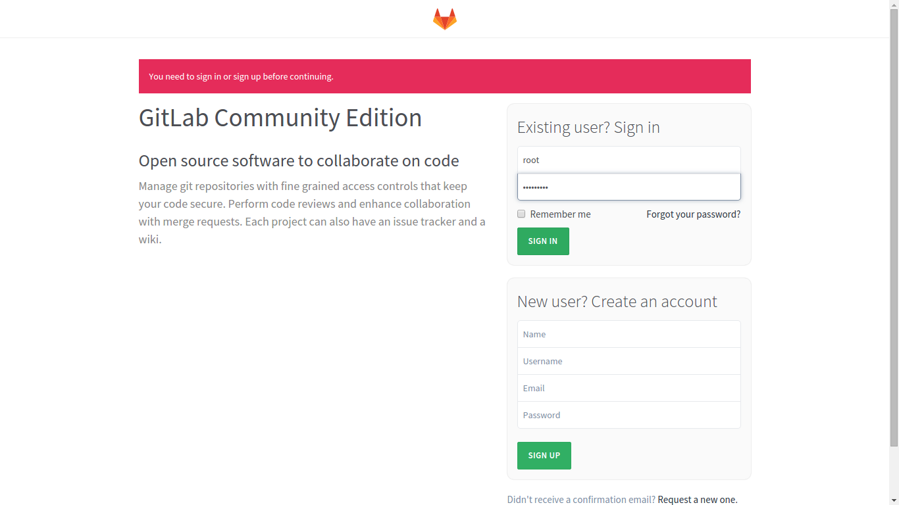

  * GitLab web arayüzüne erişim sağlandıktan sonra, ilk adım olarak root kullanıcısının parolasının değiştirilmesi gerekmektedir. 

En az 8 karakterden oluşacak yeni şifre belirlenerek, “**SET NEW PASSWORD**” butonuna basılır. Şifre değiştirme işleminin ardından web arayüz açılış sayfasına otomatik geri döner. Yeni şifre ile giriş yapılır.

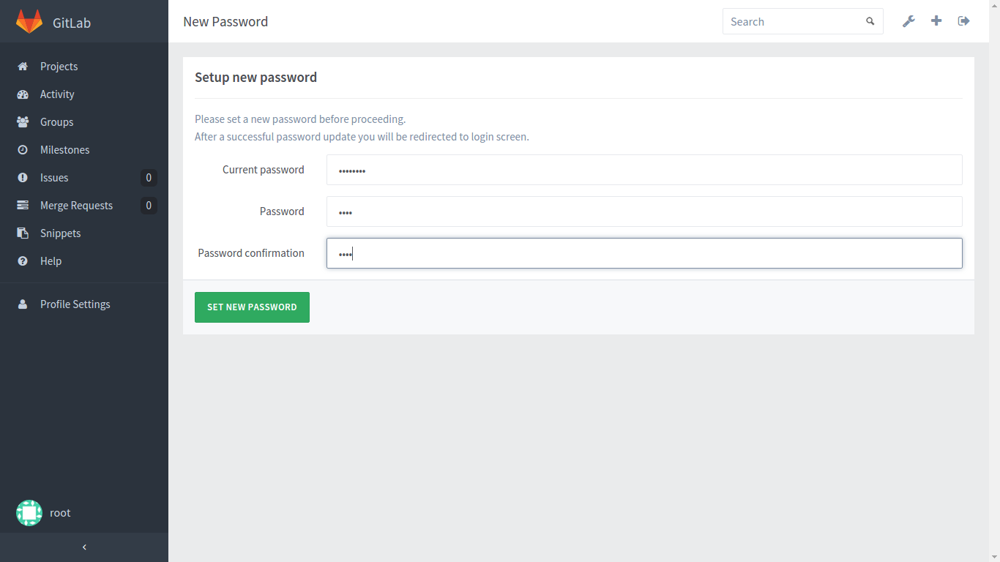

  * Root kullanıcısı ile giriş yapıldıktan sonra sağ üst köşede bulunan “**Admin Area**” simgesine basılarak sisteme tanımlanması gereken kullanıcıları oluşturmak için “**Yönetici Bölümüne**” geçiş yapılır.

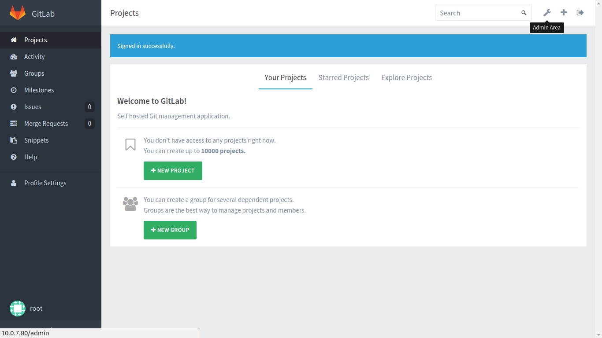

  * Yönetici bölümünde “**Users**” bölümünde yer alan “**NEW USER**” butonuna basılır.

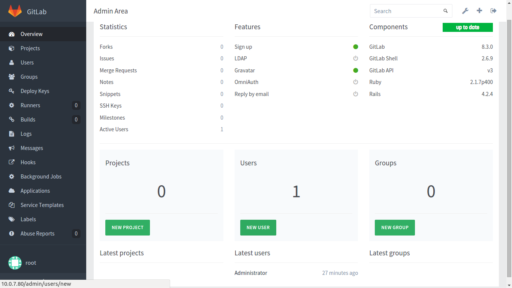

  * Öncelikli olarak FirewallBuilder kontrol paneli ile iletişimi sağlayarak onay mekanizması yapısı kapsamında Onay Kontrol, Son Onaylanmış Commit ID gibi özelliklerini çalıştıracak API kullanıcısı oluşturulur. Oluşturulacak kullanıcının isminin “**gdysapi**” olması zaruridir. Kullanıcıyı oluşturmak için “**Name**”, “**Username**” ve “**Email**” alanları doldurularak “**CREATE USER**” butonuna basılır. 

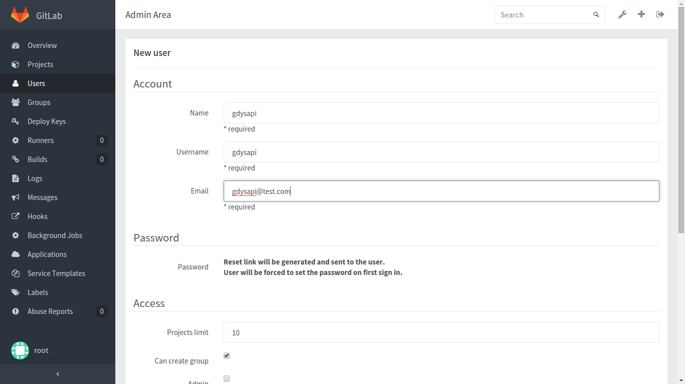

  * Kullanıcı oluşturulduktan sonra, ilgili kullanıcıya ait bilgilendirme sayfası açılmaktadır. Bu sayfada kullanıcıya şifre oluşturmak için “**EDIT**” butonuna basılır.

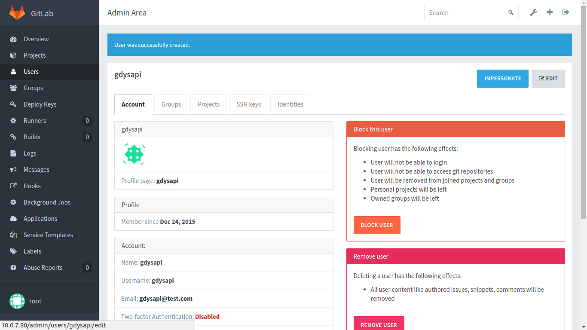

  * Açılan ekranda “**Password**” bölümünden “**gdysapi**” kullanıcı için parola belirlenir ve sayfanın en altında bulunan “**SAVE CHANGES**” butonuna basılır.

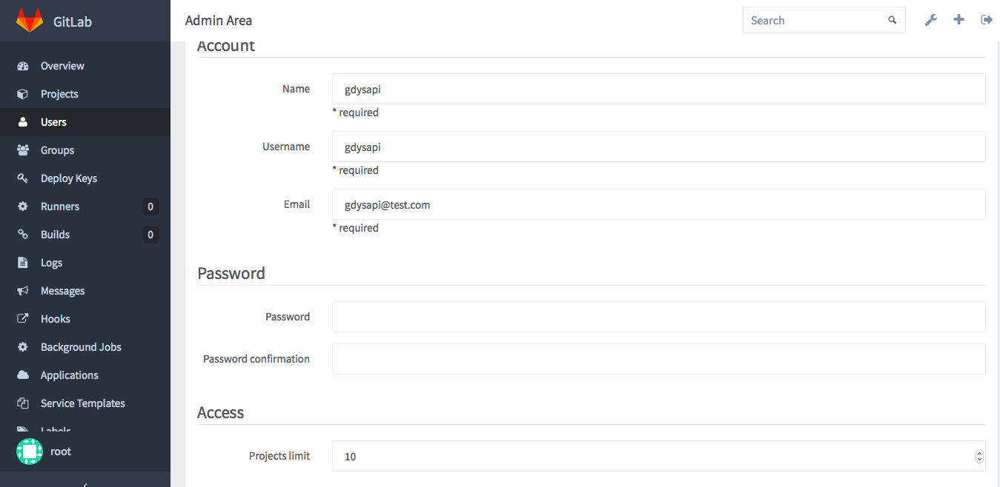

  * 3, 4 ve 5. adımlar tekrar uygulanarak bir adet kullanıcı daha oluşturulur. “**gydsapi**” kullanıcısından farklı olarak bu kullanıcı için şifre oluşturulmaz. (6 ve 7. adımlar uygulanmadan geçilecektir.) 

Oluşturulacak kullanıcının isminin “**ahtapotops**” olması zaruridir. Bu kullanıcı FirewallBuilder ile Ansible entegrasyonunu ve Ansible ile yöneteceği sunucular arasında iletişimi sağlamaktadır. Otomatizasyon yapısının çalışabilmesi için yapıyı oluşturacak sunucular arasında parolasız erişim kullanılmalıdır. Bu neden ile kullanıcı oluşturulduktan sonra aşağıdaki adımları takip ederek kullanıcıya ait açık anahtar GitLab sistemine eklenmelidir.

  * Oluşturulan “**ahtapotops**” kullanıcısına SSH-Key belirtme işlemini yapmak için sağ tarafta görünen “**IMPERSONATE**” butonuna basılarak, uygulamanın bu kullanıcı gibi davranması sağlanır.

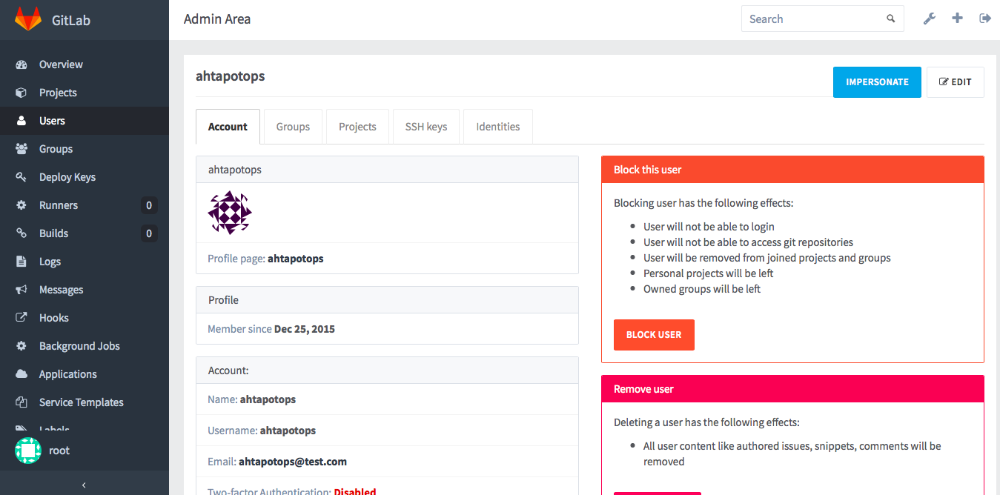

  * Impersonate işleminin başarılı gerçekleştiği sağ üstte bulanan “**Impersonate**” simgesi ile teyit edildikten sonra gelen ekranda sol taraftan “**Profile Settings**” seçeneğine tıklanır.

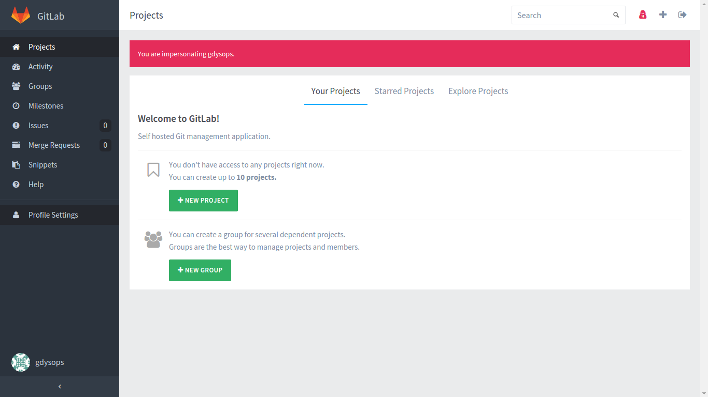

  * Açılan kullanıcı ayarlarında solda bulunan menüden “**SSH Keys**” seçeneği seçilir ve gelen sayfada "**ADD SSH KEY**" butonuna basılır.

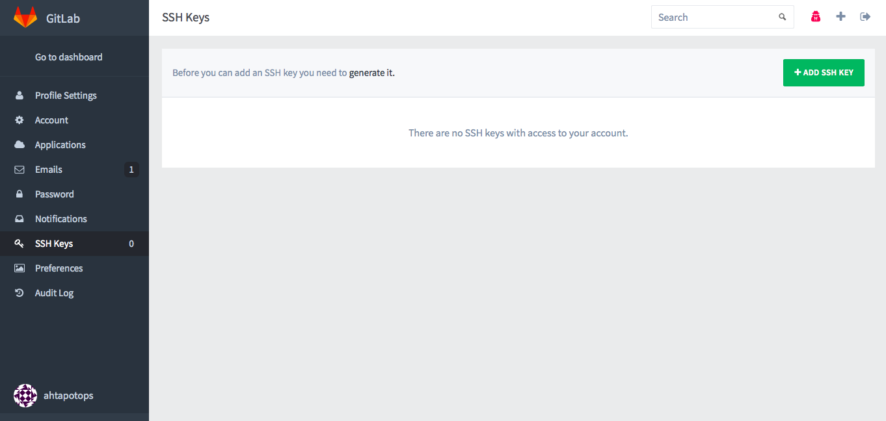

  * Ekranda “**Key**” kısmına "**ahtapotops.pub**" dosyasının içeriği kopyalanır , “**Title**” kısmına kullanıcı oluştururken belirttiğimiz posta adresi girilir. “**ADD KEY**” butonuna basılarak sisteme eklenir. 

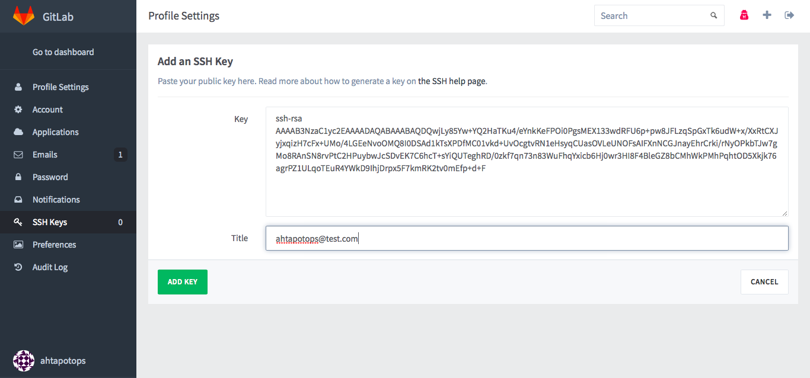

  * FirewallBuilder ve Ansible entegrasyonunu sağlıklı olarak gerçekleştirmek için iki adet proje oluşturulması gerekmektedir. FirewallBuilder tarafı için “**gdys**” Ansible tarafı için ise “**mys**” projeleri oluşturulacaktır. Proje oluşturmak için “**Go to dashboard**” butonuna basılır.


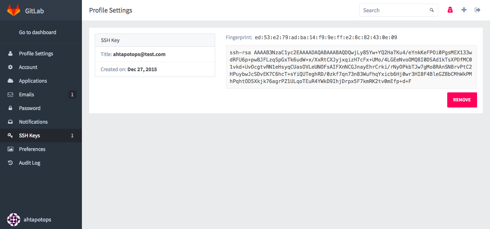

  * Ekranda bulunan “**NEW PROJECT**” butonuna basarak yeni proje oluşturma işlemi gerçekleştirilir.

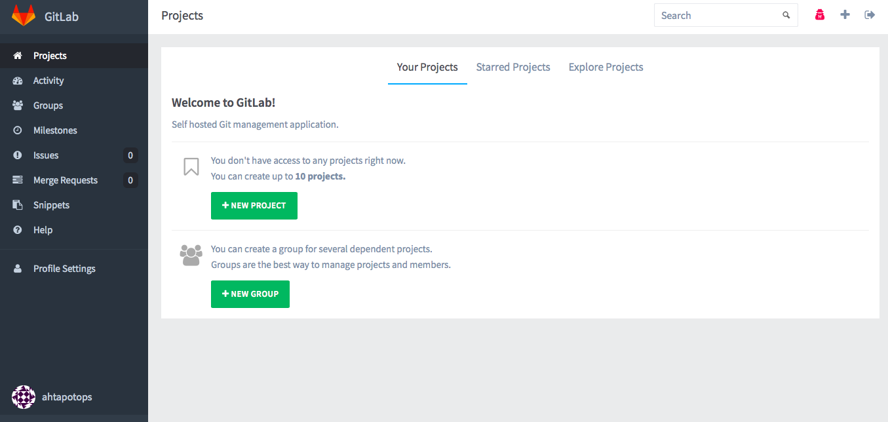

  * “**NEW PROJECT**” butonuna basıldığında gelen ekranda “**Project path**” satırında “**/**” ibaresinden sonra proje ismi olan “gdys” yazılır. İsteğe bağlı olarak “**Description**” bölümüne tanımlama yazılarak “**Private**” olacak şekilde “**CREATE PROJECT**” butonuna basılır.

**NOT :** GDYS kapsamında açılan tüm GitLab projelerinin “**Private**” olması zaruridir.

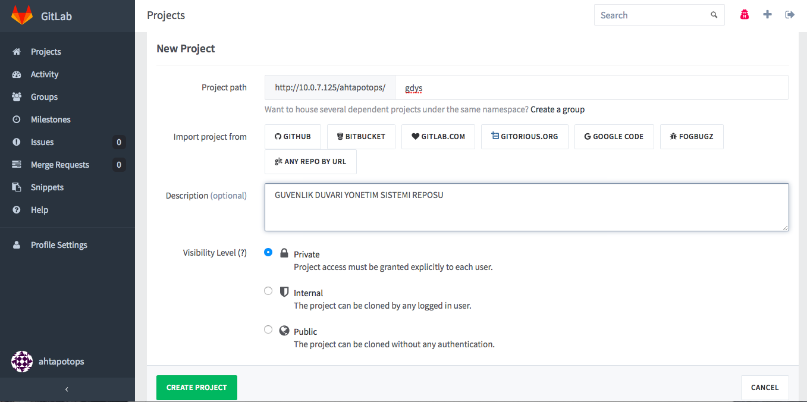

  * Proje oluşturulduktan sonra, açılan ekran proje anasayfası olup; “**gdys**” deposuna erişim hakkı olacak kullanıcıları belirtlemek için sol ağaç yapısından “**Members**” seçeneği seçilir.

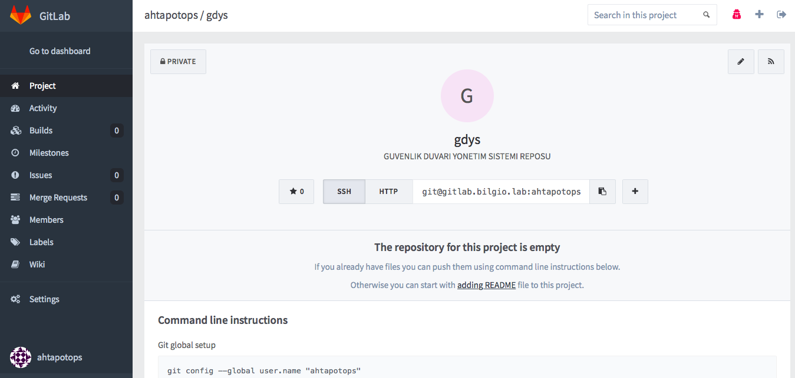

  * GitLab üzerinde oluşturulmuş “**gdys**” projesi için “**gdysapi**” ve “**ahtapotops**” kullanıcıları “**People**” bölümüne eklenerek yetkilendirilir. Yetki seviyesini belirlemek amacı ile “**Project Access**” bölümünden bu kullancılara “**Master**” yetkisi verilerek “**ADD USERS TO PROJECT**” butonuna basılır.

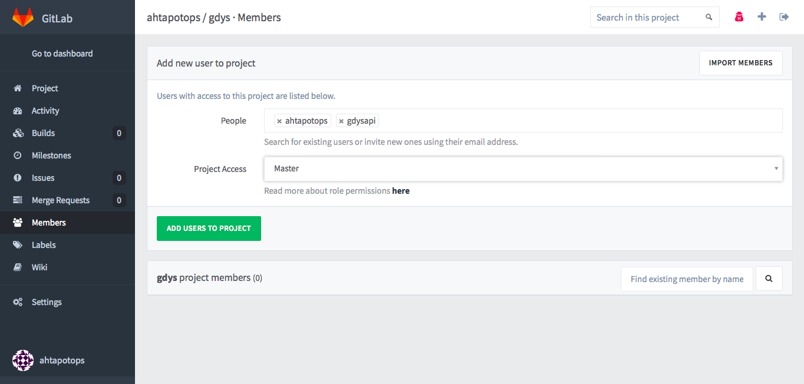

  * “**Go to dashboard**” butonuna basılarak, ana ekrana gidilerek 16. ve 17. adımlar “**mys**” deposun için tekrar uygulanır. “**mys**” deposuna ait anasayfa geldikten sonra “**Go to dashboard**” seçeneği seçilerek GitLab sayfasına gidilir.

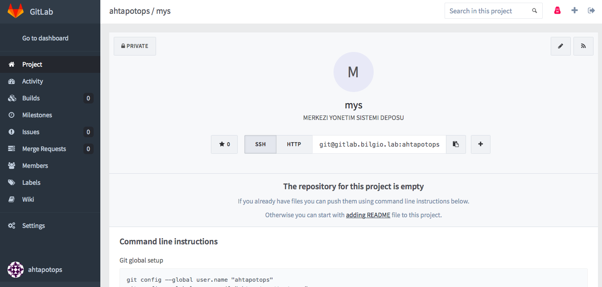

  * Onay mekanizmasının yapısı oluşturmak adına GitLab sayfasından, “**ahtapotops / gdys**” projesine gidilir.Bu yapıyı oluşturmak için projede iki adet dal oluşturulmalıdır. “**master**” ve “**onay**” dalları bu yapıyı sağlamaktadır. Öncelikli olarak “**master**” dalını oluşturmak için “**adding README**” satırına basılırak, bir dosya oluşturulur. Böylelikle master dal oluşmuş olur.

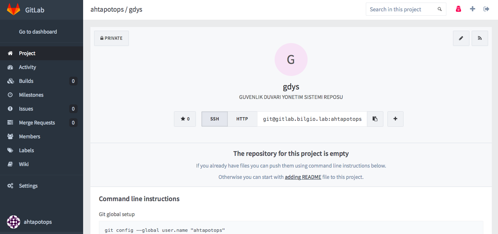

  * Açılan dosya ekranında, ilk satıra yorum olmasını sağlacak şekilde “**#**” simgesi konularak açıklama yazılır. Akabinde “**Commit message**” bölümüne yapılan işlem yazılarak “**COMMIT CHANGES**” butonuna basılır.

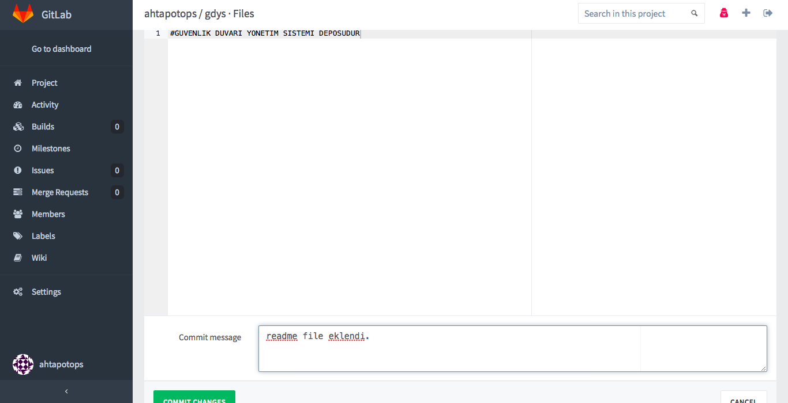

  * Oluşturulan “**master**” dalı aşağıdaki ekranda olduğu gibi gözükmektedir. “**Files**” butonuna basılarak, projeye ait dosyaların bulunduğu “**gdys**” dizinine gidilir.

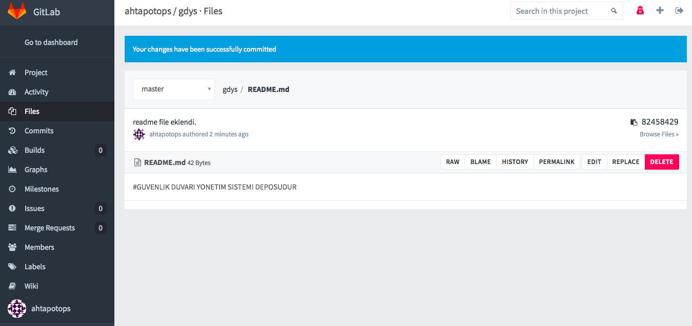

  * “**Files**” sayfasında “**+**” işaretine basılarak “**New file**” seçeneği seçilir.

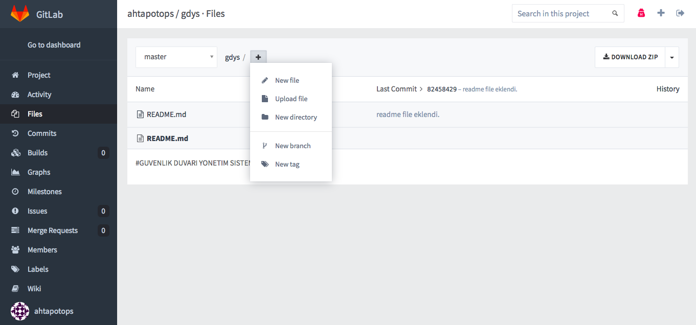

  * "**https://ahtapot.bilg.io/dosyalar/gdys-fwb/**" adresinden indirilerek, içeriği kopyalanan “**gdys.fwb**” dosyasının içeriği buraya yapıştırılır. “**master/**” ibaresinden sonraki alana “**gdys.fwb**”  ve “**Commit message**” alanına yapılan işlem yazılarak “**COMMIT CHANGES**” butonuna basılır.

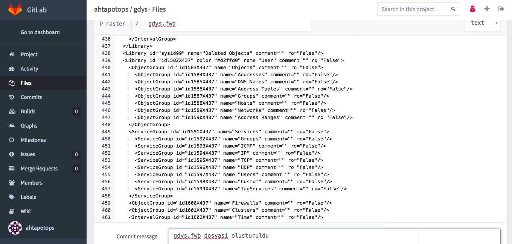

  * “**Files**” butonuna basılarak, projeye ait dosyaların bulunduğu “**gdys**” dizinine gidilir.


  * “**Files**” sayfasında “**+**” işaretine basılarak “**New directory**” seçeneği seçilir.


  * Açılan ekranda “**Directory name**” kısmında “**files**” yazılması zaruridir. “**Commit message**” bölümüne bilgi yazıldıktan sonra “**Target branch**”, “**master**” seçilir ve “**CREATE DIRECTORY**” butonuna basılır.

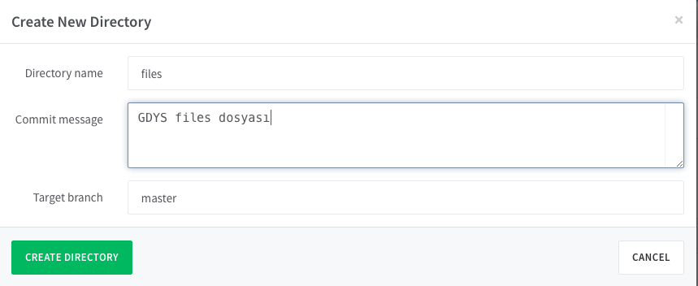

  * Dosyayı oluşturduktan sonra sol ağaç menüsünden “**Project**” seçilerek “**gdys**” deposu anasayfaya gidilir. Anasayfasında bulunan “**+**” işaretine basılarak “**New branch**” ile onay dalı oluşturulur.

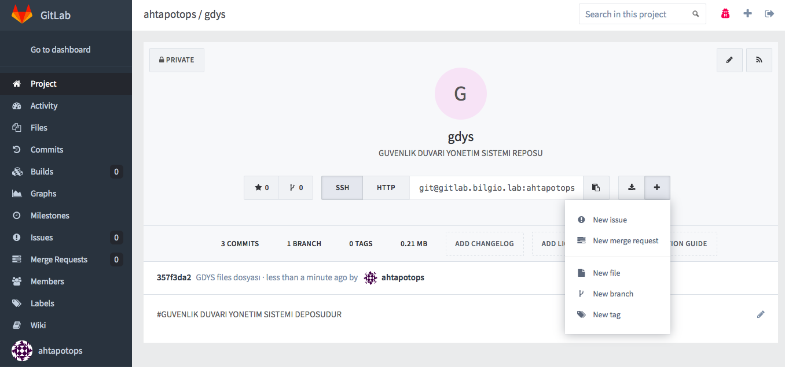

  * Açılan yeni ekranda “**Branch name**” bölümüne “**onay**” yazılarak “**CREATE BRANCH**” seçeneği seçilir.

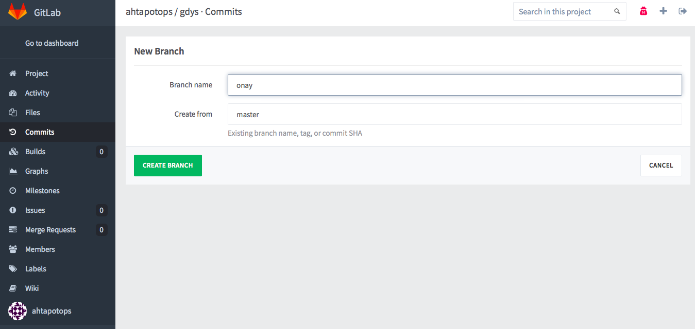

  * Ansible’a ait playbookları “**mys**” deposuna aktarmak için Ansible makinesine ssh ile bağlanılarak aşağıdaki adımlar takip edilir.

  * mys projesini yerele indirme işlemi için bulunulan dizin geçici dizin ile değiştirilir.

```
$ cd /tmp
```

  * GitLab üzerinde açılan proje aşağıdaki komut ile GitLab makinesinin yereline alınır. (“**mys_proje_URL**” bilgisi GitLab arayüzünde “Projects” altından “**mys**” projesi seçildiğinde, mys projesine ait anasayfada “**http://gitlab/root/mys**” şeklinde görüntülenmektedir.) Komutun girilmesi ile birlikte, kullanıcı adı ve parola sormaktadır. Kullanıcı adı olarak GitLab tarafında öntanımlı gelen yetkili kullanıcı “root”, parola olarak 11. adımda belirlenen parola girilmelidir.


```
$ git clone ssh://git@gitlab_sunucuadı:ssh_port/ahtapotops/mys.git 
```

  * Beşinci adımda GitLab üzerinden yerele indirilen playbooklar, bulunduğu dizin içerisinden alınırak geçici dizin altında oluşmuş olan “**mys**” klasörüne kopyalanır.

```
$ sudo cp -rf /etc/ansible/* /tmp/mys/
```

  * Dosyaların kopyalandığını teyit etmek amacı ile ilgili dizine gidilir.

```
$ cd /mys
$ ls -ltr
$ sudo chown ahtapotops:ahtapotops *
```

  * “**mys**” klasörüne kopyalanmış playbookların kopyalandığı teyit edildikten sonra, GitLab arayüzüne gönderilir.

```

$ git add --all
$ git config --global user.email “ansible@test.com”
$ git config --global user.name “Ansible Makinesi”
$ git commit -m “MYS ana dosyalari eklendi.” 
$ git push origin master

```

* GitLab kurulumunun tamamlanmasının ardından Ansible sunucusunun bu makineye erişimini kontrol etmek adına, Ansible sunucusuna SSH bağlantısı yapılarak; SSH bağlantı linki üzerinden deponun yerele alınması test edilir. “**Gitlab_sunucuadı**” bölüme kurulmuş gitlab sunucusunun adresi, “**ssh_port**” bölümüne ise sunucusunun ayarlanan sunucunun ssh port bilgisi yazılır.

```
$ cd /tmp 
$ git clone ssh://git@gitlab_sunucuadı:ssh_port/ahtapotops/gdys.git 
$ rm -rf gdys
```

* Erişimin sağlandığından emin olduktan sonra, Ansible makinesi üzerine ilk kurulum için koyduğumuz playbookların, MYS reposudan çalışmasını sağlamak için yerel gitlab sunucusu üzerindeki MYS reposu ansible makinesine clonelanarak, “**.git**” dosyası “**/etc/ansible**” dosyasına taşınır. Bu dizin altındaki tüm dosyaların sahiplik hakları “**ahtapotops**” kullanıcısına verilir.

```

$ cd /tmp/mys
$ sudo cp -rf .git /etc/ansible/ && sudo chown ahtapotops:ahtapotops /etc/ansible/.git
$ rm -rf ../mys
$ sudo chown ahtapotops:ahtapotops /etc/ansible/*

```

**NOT :** Ansible yedekli kurulacak ise, yedek sistemde sadece bu madde adımları aşağıdaki şekilde çalıştırılmalıdır.

```
$ cd /tmp
$ git clone ssh://git@gitlab_sunucuadı:ssh_port/ahtapotops/mys.git
$ cd mys/
$ sudo cp -rf .git /etc/ansible/ && sudo chown ahtapotops:ahtapotops /etc/ansible/.git
$ rm -rf ../mys
$ sudo chown ahtapotops:ahtapotops /etc/ansible/*
```

* **NOT:** Gitlab arayüz yapılandırması tamamlanması ile dökümanda yapılması istenilen değişiklikler gitlab arayüzü yerine terminal üzerinden yapılması durumunda playbook oynatılmadan önce yapılan değişiklikler git'e push edilmelidir.

```
$ cd /etc/ansible
git status komutu ile yapılan değişiklikler gözlemlenir.
$ git status  
$ git add --all
$ git commit -m "yapılan değişiklik commiti yazılır"
$ git push origin master
```

####Ansible Playbook ile FirewallBuilder Kurulumu

* **NOT:** Dökümanda yapılması istenilen değişiklikler gitlab arayüzü yerine terminal üzerinden yapılması durumunda playbook oynatılmadan önce yapılan değişiklikler git'e push edilmelidir.

```
$ cd /etc/ansible
git status komutu ile yapılan değişiklikler gözlemlenir.
$ git status  
$ git add --all
$ git commit -m "yapılan değişiklik commiti yazılır"
$ git push origin master
```
**NOT:** Kurulacak sistem, SIEM yapısına dahil edilmek isteniyorsa, kurulum sonrasında Siber Olay, Açıklık, Risk İzleme ve Yönetim Sistemi Kurulumu sayfasında bulunan [LMYS Clientlarında Ossec Agent Dağıtımı](siem-kurulum.md) başlığı incelenmelidir.

* Playbook oynatmadan önce, gitlab sunucusunun port bilgisi değiştiğinden, gitlab sunucusu ile firewall builder makinesi arasında ssh bağlantısı yapılarak, host_key kabul edilir.

```
$ ssh FQDN_SUNUCU_ADI
$ sudo su -
# ssh ahtapotops@FQDN_SUNUCU_ADI -i /home/ahtapotops/.ssh/id_rsa
# exit
```

* “**Ansible Playbookları**” dokümanında detaylı anlatımı bulunan, sunucu üzerinde gerekli sıkılaştırma işlemleri ve FirewallBuilder kurulumu yapacak olan “**firewallbuilder.yml**” playbook’u Ansible makinesinden aşağıdaki komut ile çalıştırılır.

```
$ cd /etc/ansible/
$ ansible-playbook playbooks/firewallbuilder.yml 
```

* Firewall Builder makinesinde gyds-gui dizinine izin vermek için aşağıdaki komut Firewallbuilder makinesinden çalıştırılır

```
$ sudo chown ahtapotops:ahtapotops /var/opt/gdysgui/*
```

**NOT :** FirewallBuilder makinesi yedekli kurulacak ise, yedek olacak makinenin üzerinde bu adım el ile yapılmalıdır.


####Ansible Playbook ile Rsyslog Kurulumu

* **NOT:** Dökümanda yapılması istenilen değişiklikler gitlab arayüzü yerine terminal üzerinden yapılması durumunda playbook oynatılmadan önce yapılan değişiklikler git'e push edilmelidir.

```
$ cd /etc/ansible
git status komutu ile yapılan değişiklikler gözlemlenir.
$ git status  
$ git add --all
$ git commit -m "yapılan değişiklik commiti yazılır"
$ git push origin master
```
**NOT:** Kurulacak sistem, SIEM yapısına dahil edilmek isteniyorsa, kurulum sonrasında Siber Olay, Açıklık, Risk İzleme ve Yönetim Sistemi Kurulumu sayfasında bulunan [LMYS Clientlarında Ossec Agent Dağıtımı](siem-kurulum.md) başlığı incelenmelidir.

* “**Ansible Playbookları**” dokümanında detaylı anlatımı bulunan, sunucu üzerinde gerekli sıkılaştırma işlemleri ve Rsyslog kurulumu yapacak olan “**rsyslog.yml**” playbook’u çalıştırılır.

```
$ cd /etc/ansible/
$ ansible-playbook playbooks/rsyslog.yml
```


####Ansible Playbook ile Test Firewall Kurulumu

* **NOT:** Dökümanda yapılması istenilen değişiklikler gitlab arayüzü yerine terminal üzerinden yapılması durumunda playbook oynatılmadan önce yapılan değişiklikler git'e push edilmelidir.

```
$ cd /etc/ansible
git status komutu ile yapılan değişiklikler gözlemlenir.
$ git status  
$ git add --all
$ git commit -m "yapılan değişiklik commiti yazılır"
$ git push origin master
```
**NOT:** Kurulacak sistem, SIEM yapısına dahil edilmek isteniyorsa, kurulum sonrasında Siber Olay, Açıklık, Risk İzleme ve Yönetim Sistemi Kurulumu sayfasında bulunan [LMYS Clientlarında Ossec Agent Dağıtımı](siem-kurulum.md) başlığı incelenmelidir.

* “**Ansible Playbookları**” dokümanında detaylı anlatımı bulunan, sunucu üzerinde gerekli sıkılaştırma işlemleri ve Test Firewall kurulumu yapacak olan “**testbuilder.yml**” playbook’u çalıştırılır.

```
$ cd /etc/ansible/
$ ansible-playbook playbooks/testbuilder.yml
```
####Merkezi Yönetim Sistemi Entegrasyon Adımları

* GitLab arayüzünden mys reposundaki “**hosts**” dosyasında güncel playbookların hangi makinelerde çalışacağını belirlemek için değişiklikler yapılır.

```
# sudo vi /etc/ansible/hosts
[firewallbuilder]
fwbuilder.alan.adi

[ansible]
ansible.alan.adi

[gitlab]
gitlab.alan.adi

[firewall]
fw01.alan.adi

[testfirewall]
fwtest.alan.adi

[rsyslog]
rsyslog.alan.adi

[gkts]
gkts.alan.adi
```
* Gitlab arayüzünden mys reposundaki “**roles/base/vars**” klasörü altında ntp değişkenlerinin barındıran “**ntp.yml**” dosyası içerisine "**base_ntp_servers**" fonksiyonu altında bulunan "**server1**" ve "**server2**" satırları altına NTP sunucularının FQDN bilgileri girilmelidir. Sistemde bir NTP sunucusu olduğu durumda "**server2**" satırları silinebilir yada istenildiği kadar NTP sunucusu eklenebilir. 

```
# Zaman sunucusu ayarlarini iceren dosyadir.
# Yorum satiri ile gosterilen sablon doldurularak istenilen kadar zaman sunucusu eklenebilir.
ntp:
    conf:
        source: "ntp.conf.j2"
        destination: "/etc/ntp.conf"
        owner: "root"
        group: "root"
        mode: "0644"
    service:
        name: "ntp"
        state: "started"
        enabled: "yes"

base_ntp_servers:
    server1:
        fqdn: "0.tr.pool.ntp.org"
    server2:
        fqdn: "1.tr.pool.ntp.org"
#    serverX:
#        fqdn: ""
```

* Gitlab arayüzünden mys reposundaki "**roles/base/vars**” klasörü altında rsyslog değişkenlerinin barındıran “**rsyslog.yml**” dosyası içerisine "**base_ossimcik_servers**" fonksiyonu altında bulunan “**server1**” ve “**server2**” satırları altına ossimcik sunucularına ait bilgiler girilmelidir. Sistemde bir ossimcik sunucusu olduğu durumda “**server2**” satırları silinebilir yada istenildiği kadar ossimcik sunucusu eklenebilir. Ossimcik makinelerine log gonderilmesi istenilen clientların "**client**" içerisinde fqdn bilgileri girilir.

```
# Log sunucu ayarlarini iceren dosyadir.
# Yorum satiri ile gosterilen sablon doldurularak istenilen kadar log sunucusu eklenebilir.
rsyslog:
    conf:
        source: "rsyslog.conf.j2" 
        destination: "/etc/rsyslog.conf" 
        owner: "root" 
        group: "root" 
        mode: "0644" 
    service:
        name: "rsyslog" 
        state: "started" 
        enabled: "yes"
    ActionQueueMaxDiskSpace: "2g"
    ActionQueueSaveOnShutdown: "on" 
    ActionQueueType: "LinkedList" 
    ActionResumeRetryCount: "-1" 
    WorkDirectory: "/var/spool/rsyslog" 
    IncludeConfig: "/etc/rsyslog.d/*" 
base_ossimcik_servers:
    server1:
        fqdn: "ossimcik01.gdys.local"
        port: "514"
        severity: "*"
        facility: "*"
        clients:
            client01:
                fqdn: "ansible_fqdn"
            client02:
                fqdn: "gitlab_fqdn"
#    serverX:
#        fqdn: "" 
#        port: "" 
#        severity: "*"
#        facility: "*"
#        clients:
#            client01:
#   
```

* **NOT:** Log gönderici client makinelerine rsyslog icin gerekli anahtarlar konulmalıdır. **NOT:** Anahtar oluşturulması için CA Kurulumu ve Anahtar Yönetimi dökümanındaki [Log Yönetimi Anahtar Oluşturma](ca-kurulum.md) başlığı incelenmelidir. Oluşturulan anahtarlar client makineler içerisinde aşağıdaki dizinlere konulmalıdır. "**client_fqdn**" yerine client makinenin fqdn bilgisi girilmelidir.

```
/etc/ssl/certs/rootCA.pem
/etc/ssl/certs/client_fqdn.crt
/etc/ssl/private/client_fqdn.key
```

* Gitlab arayüzünden mys reposundaki "**roles/base/vars**” klasörü altında ssh değişkenlerinin barındıran “**ssh.yml**” dosyası içerisinde bulunan "**Port**" değişkenine istenen yeni değer yazılmalıdır.

```
# Ssh degiskenlerini iceren dosyadir.
ssh:
    conf:
        source: "sshd_config.j2"
        destination: "/etc/ssh/sshd_config"
        owner: "root"
        group: "root"
        mode: "0644"
    service:
        name: "ssh"
        state: "started"
        enabled: "yes"
    TrustedUserCAKeys:
        source: "ahtapot_ca.pub.j2"
        destination: "/etc/ssh/ahtapot_ca.pub"
        owner: "root"
        group: "root"
        mode: "0644"
    RevokedKeys:
        source: "revoked_keys.j2"
        destination: "/etc/ssh/revoked_keys"
        owner: "root"
        group: "root"
        mode: "0644"
    LocalBanner:
        source: "issue.j2"
        destination: "/etc/issue"
        owner: "root"
        group: "root"
        mode: "0644"
    RemoteBanner:
        source: "issue.net.j2"
        destination: "/etc/issue.net"
        owner: "root"
        group: "root"
        mode: "0644"
    Port: "4444" 
    Protocol: "2"
    ListenAddressv4: "0.0.0.0"
    ListenAddressv6: "::"
    UsePrivilegeSeparation: "yes"
    KeyRegenerationInterval: "3600"
    ServerKeyBits: "1024"
    SyslogFacility: "AUTH"
    LogLevel: "DEBUG"
    LoginGraceTime: "90"
    PermitRootLogin: "no"
    StrictModes: "yes"
    RSAAuthentication: "yes"
    PubkeyAuthentication: "yes"
    IgnoreRhosts: "yes"
    RhostsRSAAuthentication: "no"
    HostbasedAuthentication: "no"
    IgnoreUserKnownHosts: "yes"
    PermitEmptyPasswords: "no"
    ChallengeResponseAuthentication: "no"
    PasswordAuthentication: "no"
    KerberosAuthentication: "no"
    KerberosOrLocalPasswd: "yes"
    KerberosTicketCleanup: "yes"
    GSSAPIAuthentication: "no"
    GSSAPICleanupCredentials: "yes"
    X11Forwarding: "no"
    X11DisplayOffset: "10"
    PrintMotd: "yes"
    PrintLastLog: "yes"
    TCPKeepAlive: "yes"
    UsePAM: "no"
    UseLogin: "no"
```
* Gitlab arayüzünden mys reposundaki “**roles/ansible/vars**” klasörü altında git değişkenlerini barındıran “**git.yml**” dosyası üzerinde “**repo01**” ve “**repo02**” başlıkları altındaki “**repo**” satırında bulunan “**yerel_gitlab_adresi**” bölümünün yerine Merkezi Yönetim Sistemi kapsamında kurulacak Git sunucusunun ip adresi girilmelidir. Eğer sunucularda varsayılan ssh portu dışında port kullanılacak ise “**:ssh_port**” bilgisi girilmeli, kullanılmadığı durumlarda ise “**:ssh_port**” kısmı silinmelidir.


```
# Gitin degiskenlerini iceren dosyadir
gitrepos:
    repo01:
        repo: "ssh://git@yerel_gitlab_adresi:ssh_port/ahtapotops/gdys.git"
        accept_hostkey: "yes"
        destination: "/etc/fw/gdys"
        key_file: "/home/ahtapotops/.ssh/id_rsa"
    repo02:
        repo: "ssh://git@yerel_gitlab_adresi:ssh_port/ahtapotops/mys.git"
        accept_hostkey: "yes"
        destination: "/etc/ansible/"
        key_file: "/home/ahtapotops/.ssh/id_rsa"
#    repoXX:
#        repo: ""
#        accept_hostkey: ""
#        destination: ""
#        key_file: ""
```

* Gitlab arayüzünden mys reposundaki “**roles/gkts/vars/**” klasörü altında değişkenleri barındıran “**gkts.yml**” dosyası üzerinde “**hook**” fonksiyonu altında bulunan “**server**” değişkenine Merkezi Yönetim Sisteminde bulunan ansible makinasının FQDN bilgisi, “**port**” değişkenine ansible makinesine ssh bağlantısı için kullanılcak ssh port bilgisi yazılır. 

```
$ cd roles/gkts/vars/
$ sudo vi gkts.yml
# GKTS'in degiskenlerini iceren dosyadir
gkts:
# gkts playbooku ile kurulacak paketleri belirtmektedir.
    hook:
        conf:
            source: gktshook.sh.j2
            destination: /var/opt/ahtapot-gkts/gktshook.sh
            owner: ahtapotops
            group: ahtapotops
            mode: 755
        server: ansible.domain.adi
        port: 4444

```

* Gitlab arayüzünden mys reposundaki "**roles/gkts/vars/**" dizini altında bulunan "**nginx.yml**" dosyası içerisine “**nginx**” fonksiyonunun alt fonksinyonu olan “**admin**” altında bulunan “**server_name**” değişkenine admin arayüzü için ayarlanması istenen url adres bilgisi yazılır (Örn: admin.gkts.local).  Yönetici arayüzüne erişim için internet tarayıcısında bu adres kullanılacaktır. “**nginx**” fonksiyonunun alt fonksinyonu olan “**developer**” altında bulunan “**server_name**” değişkenine admin arayüzü için ayarlanması istenen domain adres bilgisi yazılır(Örn: kullanici.gkts.local). Kullanıcı arayüzüne erişim için internet tarayıcısında bu adres kullanılacaktır. 

```
$ cd roles/gkts/vars/
$ sudo vi nginx.yml
# Nginx'in degiskenlerini iceren dosyadir
nginx:
    conf:
        source: "gkts.conf.j2" 
        destination: "/etc/nginx/conf.d/gkts.conf" 
        owner: "root"
        group: "root" 
        mode: "0644" 
    admin:
        listen: "443" 
        server_name: "admin_url_adresi" 
        access_log: "/var/log/nginx/gkts-admin-access.log"
        error_log: "/var/log/nginx/gkts-admin-error.log"
    developer:
        listen: "443" 
        server_name: "kullanici_url_adresi" 
        access_log: "/var/log/nginx/gkts-developer-access.log"
        error_log: "/var/log/nginx/gkts-developer-error.log"
    service:
        name: "nginx" 
        state: "started" 
        enabled: "yes" 
    default:
        path: "/etc/nginx/sites-available/default"
        state: "absent"
    certificate:
        source: "gkts.crt.j2"
        destination: "/etc/nginx/ssl/gkts.crt"
        owner: "root"
        group: "root"
        mode: "0644"
    key:
        source: "gkts.key.j2"
        destination: "/etc/nginx/ssl/gkts.key"
        owner: "root"
        group: "root"
        mode: "0644"
    ssldir:
        path: "/etc/nginx/ssl"
        owner: "root"
        group: "root"
        mode: "755"
        state: "directory"
```

* Gitlab arayüzünden mys reposundaki “**roles/firewallbuilder/vars**” klasörü altında değişkenleri barındıran “**git.yml**” dosyası üzerinde "**repo01**" fonksiyonu altında “**repo**” satırında bulunan “**yerel_gitlab_adresi**” bölümünün yerine Merkezi Yönetim Sistemi kapsamında kurulacak Git sunucusunun ip adresi girilmelidir.

```
# Git repolarini iceren dosyadir.
gitrepos:
    repo01:
        repo: "ssh://git@yerel_gitlab_adresi/ahtapotops/gdys.git"
        accept_hostkey: "yes"
        destination: "/etc/fw/gdys"
        key_file: "/home/ahtapotops/.ssh/id_rsa"
#    repoXX:
#        repo: ""
#        accept_hostkey: ""
#        destination: ""
#        key_file: ""
```

* Gitlab arayüzünden mys reposundaki “**roles/gitlab/vars**” klasörü altında değişkenleri barındıran “**main.yml**” dosyası içerisinde  “**external_url**” satırında bulunan “**yerel_gitlab_URL**” bölümüne GitLab sunucusunu browser üzerinden çağırırken kullanılması istenilen URL girilmelidir. GitLab SMTP ayarları için “**gitlab_email_from:**” satırına GitLab tarafından atılacak bilgilendirme postalarının hangi adres tarafından atılacağı belirtilmelidir. “**gitlab_email_display_name:**” satırında gönderilen postalarda görünmesi istenilen isim belirlenir. “**gitlab_email_reply_to:**” satırında GitLab tarafından gönderilen postalara cevap verilmesi durumunda cevabın hangi adrese yönlendirilmesi istendiği belirtilir. “**smtp_address:**” satırında smtp sunucusunun FQDN ve ya IP adres bilgileri girilir. “**smtp_port:**” satırında smtp sunucusunun kullandığı port yazılır. “**smtp_domain:**” satırında ise stmp alan adı bilgisi girilir. Yedekli kullanılacak Gitlab ortamında, git fonksiyonu altındaki “**Server**” satırına yedek gitlab sunucusunun FQDN bilgileri “**Port**” satırına ise ssh port bilgisi girilmelidir. Ansible fonksiyonu altındaki “**Server**” satırına ansible makinesinin FQDN bilgileri “**Port**” satırına ise ssh port bilgisi girilmelidir.


```
# GitLab'in degiskenlerinin tutuldugu dosyadir.
gitlab:
# git kullanicisini yapilandirmasi belirtilmektedir.
    user:
        name: git
        password: "jQCGY1Gp$rVz8u3qRyH3UCB.6MSnWToQv1qQYjYeatbBEA0pA4aqnjoTchjPDsm9CAeuk1xVKoV3MqM1C/UJZ6Fgap9XmB0"
        state: present
    service:
        name: gitlab-runsvdir
        state: started
        enabled: yes
    conf:
        source: gitlab.rb.j2
        destination: /etc/gitlab/gitlab.rb
        owner: root
        group: root
        mode: 0640
    ssl:
        directory:
            path: /etc/gitlab/ssl
            owner: root 
            group: root 
            mode: 700
            state: directory 
            recurse: no 
    ssl-crt:
        source: ssl-crt.j2
        destination: /etc/gitlab/ssl/gitlab.gdys.local.crt
        owner: root
        group: root
        mode: 600
    ssl-key:
        source: ssl-key.j2
        destination: /etc/gitlab/gitlab.gdys.local.key
        owner: root
        group: root
        mode: 600
    external_url: https://yerel_gitlab_URL
    firstrunpath: /var/opt/gitlab/bootstrapped
    gitlab_rails:
        gitlab_email_enabled: "true"
        gitlab_email_from: gitlab@Domain_Adi 
        gitlab_email_display_name: GdysGitlab 
        gitlab_email_reply_to: no-reply@Domain_Adi
        gitlab_default_theme: 2
        gitlab_shell_ssh_port: 4444
        smtp_enable: "true" 
        smtp_address: smtp_sunucu_adı
        smtp_port: 25 
        smtp_domain: domain_adi
        smtp_tls: "false" 
    nginx:
        enable: "true"
        redirect_http_to_https: "true"
    backup:
        Server: gitlab.domain_adi
        Port: 4444
    ansible:
        Server: ansible.domain_adi
        Port: 4444
```
* Gitlab arayüzünden mys reposundaki  “**roles/firewall/vars**” klasörü altında iptables değişkenlerini barındıran “**iptables.yml**” dosyası üzerinde “**deploy**” fonksiyonu altındaki “**dest_port**" bölümüne yerine Merkezi Yönetim Sistemi kapsamında kurulacak Git sunucusunun ssh portu girilmelidir.

```
# Iptables yapilandirmasini iceren dosyadir.
iptables:
    service:
        v4conf: "/etc/iptables/rules.v4"
        v6conf: "/etc/iptables/rules.v6"
    deploy:
        repopath: "/etc/fw/gdys"
        filepath: "/etc/fw/gdys/files"
        rsync_opts: "--force"
        dest_port: "ssh_port"
        recursive: "yes"

```
* ISO’dan kurulumu yapılmış her makinenin ilk planda ssh portları “**22**” olarak belirlendiğinden dolayı, ansible ilk kurulumu yapıldıktan sona her makineye belirtilen porttan bağlanacaktır. Bu sebep ile GitLab arayüzünden mys reposundaki “**ansible.cfg**” dosyasında bulunan “**remote_port**” parametresinin belirtilen port olduğu teyit edilmelidir.


```
# config file for ansible -- http://ansible.com/
# ==============================================

# nearly all parameters can be overridden in ansible-playbook 
# or with command line flags. ansible will read ANSIBLE_CONFIG,
# ansible.cfg in the current working directory, .ansible.cfg in
# the home directory or /etc/ansible/ansible.cfg, whichever it
# finds first

[defaults]
# some basic default values...

hostfile       = /etc/ansible/hosts
library        = /usr/share/ansible
remote_tmp     = /tmp
pattern        = *
forks          = 5
poll_interval  = 15
sudo_user      = root
#ask_sudo_pass = True
#ask_pass      = True
transport      = smart
remote_port    = ssh_port 

```
* Ansible makinesinin erişmesi gereken tüm makinelerin hosts dosyasını düzenlemek adına, "**roles/base/vars/host.yml**" dosyası içerisine tüm makine bilgileri yazılır.

```
$ sudo vi roles/base/vars/host.yml
# Sunucu degiskenlerini iceren dosyadir.
# Yorum satiri ile gosterilen sablon doldurularak istenilen kadar sunucu eklenebilir.

hosts:
# /etc/hosts yapilandirmasini belirtmektedir.
    conf:
        source: "hosts.j2"
        destination: "/etc/hosts"
        owner: "root"
        group: "root"
        mode: "0644"

base_host_servers:
    server01:
        ip: "X.X.X.X"
        fqdn: "ansible.gdys.local"
        hostname: "ansible01"
    server02:
        ip: "X.X.X.X"
        fqdn: "gitlab.gdys.local"
        hostname: "gitlab"
    server03:
        ip: "X.X.X.X"
        fqdn: "fwbuilder.gdys.local"
        hostname: "fwbuilder"
    server04:
        ip: "X.X.X.X"
```
* Playbooklar üzerinde ilgili değişiklik tamamlandıktan sonra, yapılan değişikliklerin git reposunda güncellenmesi için aşağıdaki komutlar çalıştırılır.

```
# cd /etc/ansible/
# git pull
```


* Tüm playbookları Ansible makinesinden ilgili sistemlerde oynatarak güncel hallerinin çalışması sağlanır.


```
# cd /etc/ansible
# ansible-playbook playbooks/ansible.yml
# ansible-playbook playbooks/gitlab.yml
# ansible-playbook playbooks/firewallbuilder.yml
# ansible-playbook playbooks/testbuilder.yml
# ansible-playbook playbooks/firewall.yml --skip-tags=deploy
# ansible-playbook playbooks/rsyslog.yml 
```

* Kurulan tüm ana bileşen ve güvenlik duvarı durum kontrolü için, Ansible sunucusu üzerinde crontab’ a “**crontab -e**” komutu kullanılarak aşağıdaki komutlar eklenir. Böylelikle her beş dakikada bir yeni güvenlik duvarı kuralları sisteme otomatik gönderilerek, durum kontrölü sağlanır. Ayrıca girişi yapılmış ve onaylanmış her yeni kural en geç beş dakika içerisinde sistemlerde aktif hale gelir. Her otuz dakikada bir ana bileşenlerin hepsi kontrol edilerek, kontrol dışı yapılan değişiklikler kaldırılır. Her bir crontab işinin başına eklenen “**MAILTO=**” parametresi ile crontab işi her çalıştığında mail göndermesi engellenir. 

```
MAILTO=“”
*/30 * * * * /usr/bin/ansible-playbook /etc/ansible/playbooks/state.yml -vvvv
MAILTO=“”
59 00 * * * /usr/bin/ansible-playbook /etc/ansible/playbooks/maintenance.yml -vvvv
```


####Ansible Playbook ile Firewall Kurulumu

* **NOT:** Dökümanda yapılması istenilen değişiklikler gitlab arayüzü yerine terminal üzerinden yapılması durumunda playbook oynatılmadan önce yapılan değişiklikler git'e push edilmelidir.

```
$ cd /etc/ansible
git status komutu ile yapılan değişiklikler gözlemlenir.
$ git status  
$ git add --all
$ git commit -m "yapılan değişiklik commiti yazılır"
$ git push origin master
```
**NOT:** Kurulacak sistem, SIEM yapısına dahil edilmek isteniyorsa, kurulum sonrasında Siber Olay, Açıklık, Risk İzleme ve Yönetim Sistemi Kurulumu sayfasında bulunan [LMYS Clientlarında Ossec Agent Dağıtımı](siem-kurulum.md) başlığı incelenmelidir.

* “**Ansible Playbookları**” dokümanında detaylı anlatımı bulunan, sunucu üzerinde gerekli sıkılaştırma işlemleri ve Firewall kurulumu yapacak olan “**firewall.yml**” playbook’u çalıştırılır.

```
$ cd /etc/ansible/
$ ansible-playbook playbooks/firewall.yml --skip-tag=deploy 
```

####Ansible Playbook ile Geçici Kural Tanımlama Sistemi Kurulumu

* **NOT:** Dökümanda yapılması istenilen değişiklikler gitlab arayüzü yerine terminal üzerinden yapılması durumunda playbook oynatılmadan önce yapılan değişiklikler git'e push edilmelidir.

```
$ cd /etc/ansible
git status komutu ile yapılan değişiklikler gözlemlenir.
$ git status  
$ git add --all
$ git commit -m "yapılan değişiklik commiti yazılır"
$ git push origin master
```
**NOT:** Kurulacak sistem, SIEM yapısına dahil edilmek isteniyorsa, kurulum sonrasında Siber Olay, Açıklık, Risk İzleme ve Yönetim Sistemi Kurulumu sayfasında bulunan [LMYS Clientlarında Ossec Agent Dağıtımı](siem-kurulum.md) başlığı incelenmelidir.

* “**Ansible Playbookları**” dokümanında detaylı anlatımı bulunan, sunucu üzerinde gerekli sıkılaştırma işlemleri ve GKTS kurulumu yapacak olan “**gkts.yml**” playbook’u çalıştırılır.

```
$ ansible-playbook playbooks/gkts.yml --connection=local --skip-tags=hook
```

###Güvenlik Duvarı Yönetim Sistemi Entegrasyon Adımları

*  Firewall Builder makinesinden Güvenlik Duvarı Yönetim Sistemi Kontrol Paneli ile GitLab sunucusuna erişmek için, FirewallBuilder makinesine ssh ile bağlanarak, GitLab sunucusunun SSL sertifikası yüklenir. Bu amaç için, Firewall builder makinesine ahtapotops kullanıcısı ile bağlanılarak root kullanıcısına geçilir.


```
$ ssh ahtapotops@firewallbuilder -p ssh_port -i ahtapotops_kullanici_anahtari
$ sudo su -
```

* Gitlab üzerinde https bağlantısını kullanıldığından, Gitlab tarafında oluşturulmuş sertifika firewallbuilder makinesine tanıtılır. Bu işlem için Firewall Builder makinesinde “**/usr/share/ca-certificates**” klasörü altına oluşturulan sertifika dosyası kopyalanır.
* Sertifika yüklemek için kullanılacak ncurs menünün açılması için environment ayarlarından “**DEBIAN_FRONTEND**” seçeneği kaldırılır.

```
# unset DEBIAN_FRONTEND
```

* Sertifika yüklemek için aşağıdaki komut çalıştırılır.

```
# dpkg-reconfigure ca-certificates
```

* Açılan ncurs menüden “**Trust new certificates from certificate authorities ?**” seçeneğine “**yes**” cevabı verilir.

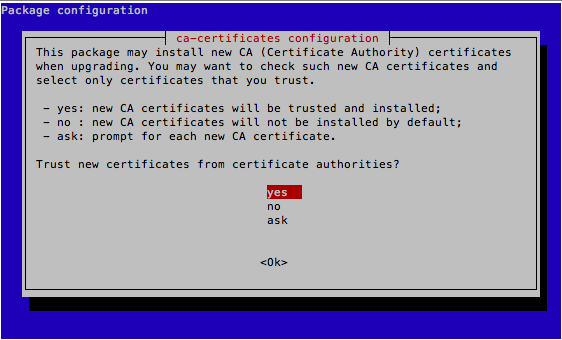

* Bir sonraki ekranda “**bilgio.crt**” dosyası seçilerek “**Ok**” butonuna basılır. Ve böylelikle sertifika yükleme işlemi tamamlanmış olur.

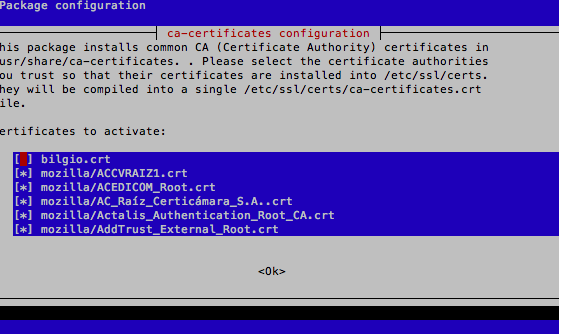

* Firewall Builder makinesinin gitlab arayüzüne erişimini sağlamak için makine içerisinde "**ssh-keygen**" komutu ile key oluşturulmalıdır. Aşağıdaki komut çalıştırıldıkdan sonra "**/home/ahtapotops/.ssh**" dizini içerisine public ve private keylerin oluşuturulduğu görülmektedir.
```
ssh-keygen -Lf id_rsa-cert.pub
```
* Gitlab arayüzüne Firewall Builder makinesinin bağlanabilmesi için yukarıda oluşuturulan ve  "**/home/ahtapotops/.ssh**" dizini içerisinde buşunan "**id_rsa.pub**" public keyi Gitlab Kurulum dosyasında antıldığı gibi ssh key olarak eklenmelidir.
* AHTAPOT CA Kurulumu ve Anahtar Yönetimi dokümanında tarif edildiği üzere, her kullanıcı için X11 kullanabilecek ve sadece FirewallBuilder uygulamasına erişebilecek  kısıtlı erişime sahip olacak CA anahtarı oluşturulur. Kullanıcılar için anahtar oluşturulması tamamlandıktan sonra SSH x-forwarding ile açılan tünel içerisinden “**Güvenlik Duvarı Yönetim Sistemi Kontrol Paneli**” uygulamasına kontrollü olarak aşağıdaki komut ile ulaşılır.
```
$ sudo ssh -X ahtapotops@FirewallBuilder_IP -i /anahtarin/dizini/kullanici01
```
* Erişim başarılı bir şekilde sağlandığında, Güvenlik Duvarı Yönetim Sistemi Kontrol Paneli uygulaması otomatik olarak açılacaktır.


* “**Düzenle**” butonu altından “**Yapılandırma Ayarları**” seçilerek ilk kullanım öncesinde yapılması gereken yapılandırma ayarları yapılır. Yapılandırma ayarları ekranında bulunan “**Onay Mekanizması**” seçeneği ile Güvenlik Duvarı Yönetimin Sisteminde yapılacak değişikliklerin onay mekanizmasına dahil olup olmayacağı belirlenir. İlk açılışta “**Kapalı**” olarak gelen seçim onay mekanizmasını devreye almak için “**Açık**” konumuna getirilmelidir. 


* Açıldığında kilitli olarak gelen “**Yapılandırma Ayarları**” üzerinde değişiklik yapmak için “**Kilidi Aç**” butonuna basılır ve açılan ekrana FirewallBuilder Makinesinın “**root**” kullanıcısına ait şifre girilir.
* Değiştirebilir duruma gelen “**Dizin Yapılandırma**” tabında, gerekli bilgi girişleri sağlanır ve “**Kaydet**” butonuna basılır.
    * “**Yapılandırma Dosya Adı**” satırında seçim otomatik olarak gelmektedir. Bu dizin, FirewallBuilder uygulamasına ait yapılandırmayı sakladığı XML dosyası olup, ilk çalıştırıldığında, Yerel GitLab’a konumlandırılmış olan ve içerisinde herhangi bir yapılandırma bulunmayan “**/etc/fw/gdys**” dizininde bulunan “**gdys.fwb**” dosyasından açılmaktadır. Onay mekanizmasının çalışabilmesi için belirtilen dizin altından bu dosyanın seçilmesi zaruridir.
    * “**Test Betik Dizini**” satırında, söz dizimi bakımından kontrol edilmek üzere test Makinesina gönderilmeden önce betiklerin konumlandırılacağı dizindir. Bu satıra “**/home/ahtapotops/testfw/**” yazılması zaruridir.
    * “**Hata Bildirim Dizini**” alanına, test betiklerinde hata alınması durumda ilgili hata ve logunun yazılması için oluşturulmuş ve tüm Ahtapot projesi kapsamında log yapısı için kullanılan “**/var/log/ahtapot/**” dizini girilir. Yapının bütünlüğünü korumak adına belirtilen dizinin girilmesi zaruridir.
    * “**Test Makinesi IP Adresi**” satırına AHTAPOT Test Güvenlik Duvarı Kurulum dokümanı takip edilerek kurulan test güvenlik duvarı makinesinın ip adresi yazılır.
    * “**Test Makinesi Kullanıcı Adı**” bilgisi olarak “**kontrol**” kullanıcısı girilmesi zaruridir.
    * “**Test Makinesi Kopya Dizin**” alanı test makinesine gönderilen betiklerin konumlandırılacağı dizini belirtmekte olup, ahtapotops kullanıcısının ana dizini olan “**/home/kontrol/**” olması zaruridir.
    * “**Test Makinesi Port Numarası**” alanı test makinesine bağlantı sağlanırken kullanılacak ssh portunun belirtildiği alandır.
* “**Gitlab Yapılandırma**” tabına geçiş yapılarak, onay mekanizması için AHTAPOT GitLab Kurulum dokümanı takip edilerek yerele kurulmuş olan GitLab sunucusunun bilgileri girilirek “**Kaydet**” butonuna basılır.
    * “**GitLab Bağlantı Adresi**” satırına yerele kurulmuş olan GitLab sunucunun FQDN bilgisi “**https://Gitlabsunucu FQDN**” şeklinde yazılır.
    * “**GitLab Kullanıcı Adı**” satırına “**gdysapi**” kullanıcısının girilmesi zaruridir
    * “**GitLab Kullanıcı Parolası**” satırına “**gdysapi**” kullanıcısı için belirlenmiş olan parolanın girilmesi zaruridir.
    * “**GitLab Onay Dalı**” satırında “**onay**” dalının belirtilmesi zaruridir.
    * “**GitLab Ana Dal**” bilgisi  olarak “**master**” dalının belirtilmesi zaruridir.
    * “**GitLab Proje Adı**” bilgisi olarak “**gdys**” proje adının belirtilmesi zaruridir.

**NOT :** GitLab yapılandırma ekranında girilen bilgilerin  AHTAPOT GitLab Kurulum dokümanı Yapılandırma İşlemleri bölümünde onay mekanizması için oluşturulan proje bilgilerini içermesi zaruridir. Maddelerde belirtilmiş zaruri bilgiler GitLab Kurulum dokümanı takip edilerek yapılan kurulum sonrasında oluşan bilgilerdir. Kurulum aşamasında bu bilgilerden bir ve ya birden fazlasında değişiklik yapılır ise bu adımda değişikliği içeren bilgiler girilmelidir.


* Yapılandırma işlemlerinin tamamlanmasının ardında “**Kilitle**” butonuna basılarak bu alanlarda değişiklik yapılması engellenir. “**x**” işaretine basılarak “**Yapılandırma Ayarları**” ekranından çıkılır.
* Yapılandırma işlemleri tamamlandıktan sonra, “**Çalıştır**” butonları aktif hale gelir. Firewall Builder uygulamasında ilk kullanım ayarlarını yapmak üzere “**Onaylanmış Ayalar ile Çalıştır**” seçeneği seçilirek Firewall Builder arayüzü açılır.


* Açılan Firewall Builder uygulamasına onay mekanizması entegrasyonunda kullanılan betikleri dahil etmek için “**Edit**” seçeneğine basılarak “**Preferences...**” ekranı açılır. 


*  Ayarlar ekranında “**Working directory:**” bölüme GitLab üzerinde bulunan “**gdys**” deposunda çalışmak için “**/etc/fw/gdys**” dizini girilmesi zaruridir. İlgili bilgi girildikten sonra “**Installer**” tabına geçilir.


* “**Installer**” sekmesinde “**A full path to the Secure Shell utility**” bölüme Güvenlik Duvarı Yönetim Sistemi Kontrol Paneli uygulaması kapsamında geliştirilen installer.py betiğinin adresi olan “**/var/opt/gdysgui/installer.py**” satırının; “**A full path to the SCP utility**” bölümüne ise preinstaller.py betiğinin adresi olan “**/var/opt/gdysgui/preinstaller.py**” satırının girilmesi zaruridir. Seçimlerin yapılmasının ardından “**OK**” butonuna basılarak; ana ekrana dönüş yapılır.


* Bu adımlar tamalandıktan sonra GDYS entegrasyon işlemi tamamlanmış, olup kullanıma hazır hale gelmiş olacaktır.


####Kurulum Sonrası Yapılacak Kontroller

* Kurulum işlemleri tamamlandığında, “**Base**” playbookunda var olan “**ssh_port**” değişkeni değiştirildi ise, sunuculara bağlantı yapılacak ssh port değiştiğinden GitLab arayüzünden “**ahtapotops/mys**” projesi açılarak “**Files**” dizini altındaki “**ansible.cfg**” dosyasında bulunan “**remote_port**” parametresi mevcut ssh port bilgisi ile değiştirilmelidir.

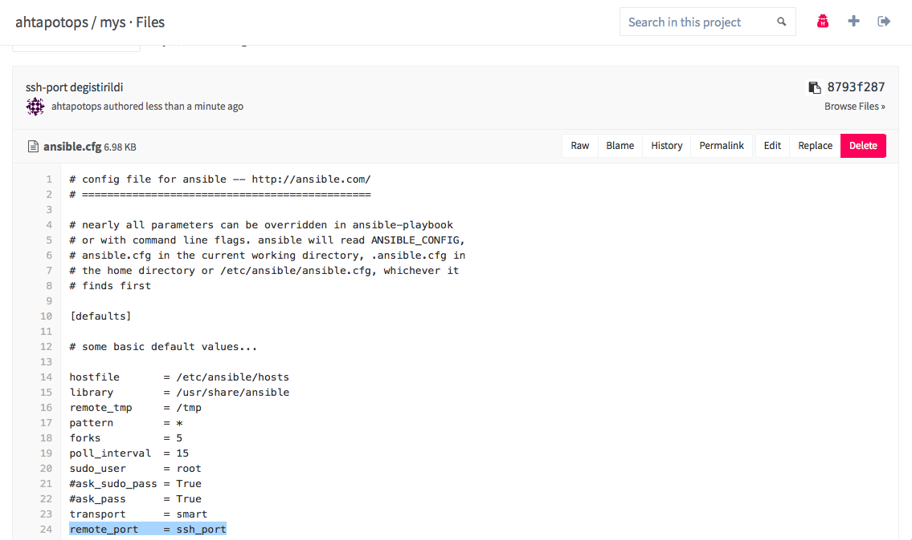

* “**/etc/fw/gdys**” ile “**/etc/ansible**” altındaki ve “**/home/ahtapotops**” dizininde bulunan gizli klasör olan “**.git**” klasörünün altındaki tüm dosyaların sahibinin ahtapotops kullanıcısı olmasına dikkat edilmelidir. Bunun için aşağıdaki komutları kullanılabilir.
```
# sudo chown ahtapotops:ahtapotops -R /etc/fw/gdys/
# sudo chown ahtapotops:ahtapotops -R /etc/ansible/
# sudo chown ahtapotops:ahtapotops -R /home/ahtapotops/.ssh/
```
* SSH Port değiştiği durumlarda daha önce kayıt girilmiş, “**known_host**” dosyası güncelliğini yitireceğinden, yeniden ekleme yapmak için “**root**” ve “**ahtapotops**” kullanıcıları ile karşılıklı ssh bağlantısı sağlanması gerekmektedir. Bunun için aşağıdaki komutlar her sunucudan diğer bir sunucuya doğru çalıştırılmalı ve sunucu anahtarlarının kabul edilmesi sorulduğunda “**yes**” yazılmalıdır.
```
$ ssh FQDN_SUNUCU_ADI -p SSH_PORT
$ sudo su -
# ssh ahtapotops@FQDN_SUNUCU_ADI -p SSH_PORT -i /home/ahtapotops/.ssh/id_rsa
```

**NOT :** Sisteme ISO üzerinden kurulmuş ve ilk ansible ile kurulumları yapılacak makinelerde ansible playbookların çalıştırılabilmesi için, “**/etc/ansible**” altında bulunan “**ansible.cfg**” dosyasındaki “**remote_port**” parametresi öncelikle “**22**” yapılmalı ve playbook çalıştıktan sonra bu dosyadaki “**remote_port**” parametresine belirlenen “**ssh_port**” girilmelidir.


**Sayfanın PDF versiyonuna erişmek için [buraya](merkezi-yonetim-sistemi-ile-ahtapot-kurulumlari-yapilmasi.pdf) tıklayınız.**
