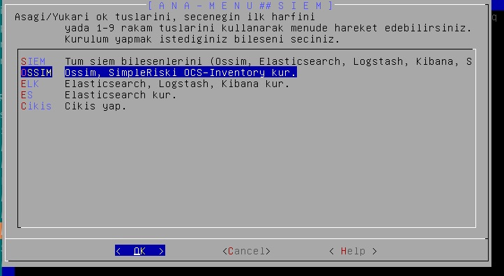
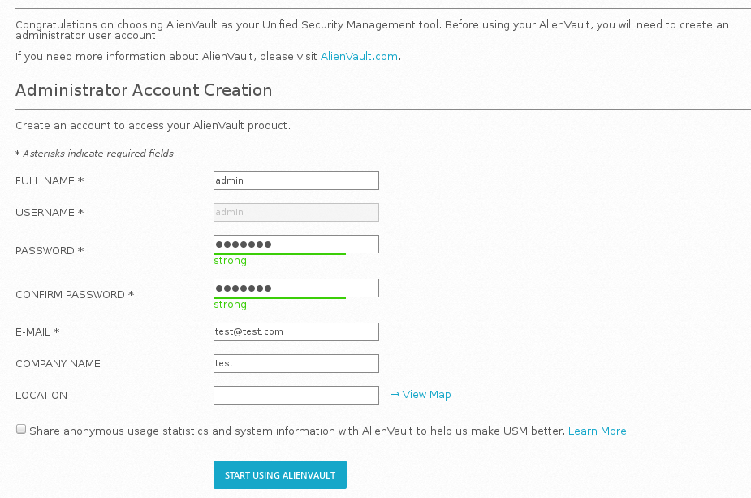
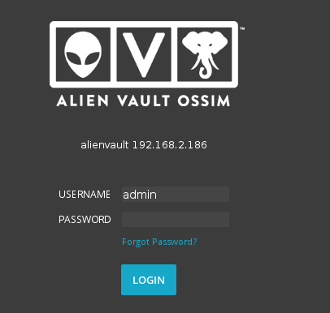

# Siber Olay, Açıklık, Risk İzleme ve Yönetim Sistemi Kurulumu
------

[TOC]

------

Bu dokümanda, Ahtapot bütünleşik güvenlik yönetim sisteminde kullanılan Siber Olay, Açıklık, Risk İzleme ve Yönetim Sistemini sunucusunun kurulum prosedürü anlatılıyor.

### OSSIM Kurulumu

**NOT:** Yapılacak tüm OSSIM kurulumları, internet bağlantısı olmaksınız, kurulum mediası üzerinden "**offline**" olarak yapılmalıdır.

 * Pardus Temel ISO dosyasından oluşturulmuş ve OSSIM kuruluması için özelleştirilmiş OSSIM ISO'su sunucu üzerinde açılır. Açılan ekranda “**Pardus’u Kur**” seçeneği seçilerek ilerlenir.


 * ISO üzerinden açılan makinede öncelikli olarak ağ yapılandırması yapılır. Açılan ilk ekranda “**IP address:**” satırının altında bulunan alana sunucunun sahip olması istenilen IP adresi girilerek “**Continue**” seçeneği seçilir.


 * Ağ yapılandırmasının ikinci aşaması olarak ağ maskesi bilgisi “**Netmask:**” satırının altında bulunan alana girilerek “**Continue**” seçeneği seçilir.


 * Açılan yeni ekranda, “**Gateway:**” satırının altında bulunan alana ağ geçidi bilgisi girilerek “**Continue**” seçeneği seçilir.


 * Ağ yapılandırma ayarları bakımdan erişim bilgisi olarak girilecek son bilgi olan isim sunucusuna ait IP adresi “**Name server addresses:**” satırının altında bulunan alana girilerek “**Continue**” seçeneği seçilir.


 * Ağ yapılandırma ayarları kapsamında makineye verilmesi planlanan isim “**Hostname:**” satırının altında bulunan alana girilerek “**Continue**” seçeneği seçilir.


 * Makinenin dahil olacağı etki alanı bilgisi “**Domain name:**” satırının altında bulunan alana girilerek “**Continue**” seçeneği seçilir.


 * Makineye ihtiyaç halinde konsol girişinde kullanmak üzere “**Root**” kullanıcısına atanacak parola “**Root password:**” satırının altına girilir.


 * Bir önceki adımda belirlenen parolayı teyit etmek için “**Re-enter password to verify:**” satırına parola tekrar girilir.


 * Root parolası belirlendikten sonra “**Partition disks**” ekranı gelir. Bu ekranda "**Partitoning scheme:**" altında bulunan “**All Files in one partition (recommended for new users)**” seçeneği seçilir ve ENTER tuşuna basılır.


 * Ağ yapılandırma bilgilerinin girilmesi ile, sistem kurulumuna devam eder. 


 
 * Sunucunun Pardus reposuna erişimi olmadığı durumda aşağıda verdiği hata sonrasında kurulum medyası repo olarak kullanılabilmektedir.. Bunun için “**Go Back**” seçeneği seçilir.
        

		
* Gelen “**Continue without a network mirror?**” ekranında “**Yes**” seçeneği seçilerek kuruluma devam edilir.

	

 * Gelen “**Install the GRUB boot loader on a hard disk**” ekranında, "**Device for boot loader installation:**" seçeneğinin altında bulunan “**/dev/sda (ata-VBOX_HARDDISK_….)**” seçeneği seçilerek ENTER tuşuna basılır.


 * Kurulum şeklinin seçilmesinin ardından, Pardus Kurumsal 5 giriş ekranı gelerek kurulum tamamlanır.


 * Kurulum tamamlandıktan sonra sunucu yeniden başlatılacaktır. Sunucu tekrar başladıktan sonra, "**root**" kullanıcı ile makinaya erişim sağlanır. Erişim sağlandığında aşağıda bulunan ekran gelmektedir. Tüm bileşenlerin aynı sunucuya kurulması için "**SIEM**" seçeneği, Ossim bileşenlerinin kurulması için "**OSSIM**" seçeneği, MYS' den bağımsız olarak ElasticSearch kurulumu için ise, "**ELK**" ve ya "**ES**" seçeneği seçilir. Merkezi yönetim sistemi ile ELK yönetimi yapılmak isteniyorsa, Ahtapot Temel ISO kurulumunu takiben "**ElasticSearch**" playbooku oynatılmalıdır.



 * Kurulum tamamlandıktan sonra, Ossim makinasının adı "**alientvault**" olarak değişmiş olarak görülecektir. Hostname bilgisini güncel haline geri getirmek için "**/etc/hostname**" ve "**/etc/hosts**" dosyalarında düzenleme yapılmalıdır. Tercih edilen metin düzenleyici ile "**/etc/hostname**" dosyasında "**alientvault**" yazan satır güncel makina ismi ile değiştirilir. Kurulum sırasında "**/etc/hosts**" dosyasının en alt satırına eklenen "**IP adress alienvault.domain alienvault**" satırı silinir.
 
 * Ossim kurulumlarının tamamlanması ile internet browser'ına Ossim IP adresi yazılarak Web arayüzü yapılandırılması tamamlanmalıdır. Ossim web arayüzü ilk açılışta admin kullanıcısının şifresinin belirlenmesini istemektedir.



 * Ossim gerekli bilgiler girilmesi ile Ossim web arayüzüne ulaşılır.
 


 * Kurulan yapıya göre hem Ossim hem de Ossim Kolerasyon makinası olabilecek durumdadır. Internet bağlantısı yeniden açılarak, her iki makina arasındaki ayrımı yapılacak rsyslog yapılandırması belirlemektedir. Öncelikli olarak sunucular anahtarlar ile iletişim kurabilmesi için "**rsyslog-gnutls**" paketi yüklenir.
```
apt-get install rsyslog-gnutls
```

 * Kurulan makinaya OSSIM görevini vermek için, aşağıda bulunan "**ossim01_rsyslog.conf**" dosyası ossim makinasının "**/etc/rsyslog.conf**" içerisine kopyalanır. İlgili dosya içerisinde bulunan mevcut yapilandirma tamamen değiştirilmemekte olup, "**/etc/rsyslog.conf**" dosyasında bulunan "**GLOBAL DIRECTIVES**" bölümü bitiminde "**RULES**" bölümünün üzerinde kopyalanmalıdır.
```
###########################
#### GLOBAL DIRECTIVES ####
###########################

#
# Use traditional timestamp format.
# To enable high precision timestamps, comment out the following line.
#
$ActionFileDefaultTemplate RSYSLOG_TraditionalFileFormat

#
# Set the default permissions for all log files.
#
$FileOwner root
$FileGroup adm
$FileCreateMode 0640
$DirCreateMode 0755
$Umask 0022

#
# Where to place spool and state files
#
$WorkDirectory /var/spool/rsyslog

#
# Include all config files in /etc/rsyslog.d/
#
$IncludeConfig /etc/rsyslog.d/*.conf

#OSSIM rsyslog yapilandirmasi buraya eklenmelidir.

###############
#### RULES ####
###############
```

 * Dosya içerisinde keyler ve logları gönderecek rsyslog ile ossim korelasyon makinelerinin fqdn blgileri düzenlenir.
**NOT:** Anahtar oluşturulması için CA Kurulumu ve Anahtar Yönetimi dökümanındaki [Log Yönetimi Anahtar Oluşturma](ca-kurulum.md) başlığı incelenmelidir.
**NOT:** OSSIM makinasına istemci makina bağlanmayacak ise, "**##nxlog ile client baglanmasi durumunda kullanılır**" ve "**##rsyslog ile client baglanmasi durumunda kullanılır**" satırları altında bulunan yapılandırma satırlarının başına "**#**" işareti konularak yorum satırı haline getirilir.
```
$ModLoad imtcp
$DefaultNetstreamDriver gtls

$InputTCPServerStreamDriverMode 1
$InputTCPServerStreamDriverAuthMode anon
$InputTCPServerRun 514

#ossim makinenin ssl keyleri verilir

$DefaultNetstreamDriverCAFile  /directory/of/keys/rootCA.pem
$DefaultNetstreamDriverCertFile /directory/of/keys/ossim01.crt
$DefaultNetstreamDriverKeyFile /directory/of/keys/ossim01.key

$ActionQueueType LinkedList
$ActionQueueFileName srvrfwd
$ActionResumeRetryCount -1
$ActionQueueSaveOnShutdown on

$ModLoad imfile
$InputFileName /var/ossec/logs/alerts/alerts.log
$InputFileTag ossimcorr
$InputFileStateFile ossec-alerts
$InputFileFacility local6
$InputFilePollInterval 1
$InputFilePersistStateInterval 1
$InputRunFileMonitor

##nxlog ile client baglanmasi durumunda kullanılır
$InputFileName /var/log/nxlog/client.log
$InputFileTag nxlogclient
$InputFileStateFile nxlogclientraw
$InputFileFacility local5
$InputFilePollInterval 1
$InputFilePersistStateInterval 1
$InputRunFileMonitor

##rsyslog ile client baglanmasi durumunda kullanılır
$InputFileName /var/log/client.log
$InputFileTag rsyslogclient
$InputFileStateFile rsyslogclientraw
$InputFileFacility local5
$InputFilePollInterval 1
$InputFilePersistStateInterval 1
$InputRunFileMonitor


$InputFileName /var/ossec/logs/alerts/alerts1.log
$InputFileTag ossimcik
$InputFileStateFile ossec-alert1
$InputFileFacility local7
$InputFilePollInterval 1
$InputFilePersistStateInterval 1
$InputRunFileMonitor

#ossim makinenin ssl keyleri ve ossim korelasyon rsyslog makinelerinin fqdn bilgileri verilir

if $syslogfacility-text == 'local6' then {
        action( type="omfwd"
                Target="ossimcorr.gdys.local"
                Port="514"
                Protocol="tcp"
                Action.ResumeRetryCount="-1"
                StreamDriver="gtls"
                StreamDriverMode="1"
                StreamDriverAuthMode="anon"
                StreamDriverCertFile="/directory/of/keys/ossim01.crt"
                StreamDriverKeyFile="/directory/of/keys/ossim01.key"
                queue.Type="LinkedList"
                queue.FileName="forwarding"
                queue.SaveOnShutdown="on"
                queue.MaxDiskSpace="5000m"
                                )
        action( type="omfwd"
                Target="rsyslog01.gdys.local"
                Port="514"
                Protocol="tcp"
                Action.ResumeRetryCount="-1"
                StreamDriver="gtls"
                StreamDriverMode="1"
                StreamDriverAuthMode="anon"
                StreamDriverCertFile="/directory/of/keys/ossim01.crt"
                StreamDriverKeyFile="/directory/of/keys/ossim01.key"
                queue.Type="LinkedList"
                queue.FileName="forwarding"
                queue.SaveOnShutdown="on"
                queue.MaxDiskSpace="5000m"
                                )
        stop
}

if $syslogfacility-text == 'local7' then {
        action( type="omfwd"
                Target="ossimcorr.gdys.local"
                Port="514"
                Protocol="tcp"
                Action.ResumeRetryCount="-1"
                StreamDriver="gtls"
                StreamDriverMode="1"
                StreamDriverAuthMode="anon"
                StreamDriverCertFile="/directory/of/keys/ossim01.crt"
                StreamDriverKeyFile="/directory/of/keys/ossim01.key"
                queue.Type="LinkedList"
                queue.FileName="forwarding"
                queue.SaveOnShutdown="on"
                queue.MaxDiskSpace="5000m"
                                )
       stop
}

##ossim'e client baglanması durumunda kullanılır

if $syslogfacility-text == 'local5' then {
        action( type="omfwd"
                Target="rsyslog01.gdys.local"
                Port="514"
                Protocol="tcp"
                Action.ResumeRetryCount="-1"
                StreamDriver="gtls"
                StreamDriverMode="1"
                StreamDriverAuthMode="anon"
                StreamDriverCertFile="/directory/of/keys/ossim01.crt"
                StreamDriverKeyFile="/directory/of/keys/ossim01.key"
                queue.Type="LinkedList"
                queue.FileName="forwarding"
                queue.SaveOnShutdown="on"
                queue.MaxDiskSpace="5000m"
                                )
#        stop
}

$template Alerts, "/var/ossec/logs/alerts/alerts1.log"
$template MsgFormat,"%msg:2:10000%\n"
$template USB, "/var/log/usb.log" #rsyslog ile client baglanmasi durumunda kullanılır
$template RemoteHost, "/var/log/client.log" #rsyslog ile client baglanmasi durumunda kullanılır
if($fromhost-ip != '127.0.0.1' and $msg contains 'AV - Alert -') then -?Alerts;MsgFormat
& ~
if($fromhost-ip != '127.0.0.1' and $msg contains 'New USB device found') then -?USB #rsyslog ile client baglanmasi durumunda kullanılır
if($fromhost-ip != '127.0.0.1' and $msg contains 'Product') then -?USB #rsyslog ile client baglanmasi durumunda kullanılır
if($fromhost-ip != '127.0.0.1' and $msg contains 'Manufacturer') then -?USB #rsyslog ile client baglanmasi durumunda kullanılır
if($fromhost-ip != '127.0.0.1' and $msg contains 'SerialNumber') then -?USB #rsyslog ile client baglanmasi durumunda kullanılır
if($fromhost-ip != '127.0.0.1' and $msg contains 'USB disconnect') then -?RemoteHost #rsyslog ile client baglanmasi durumunda kullanılır
if($fromhost-ip != '127.0.0.1' and $msg contains ' usb ') then ~ #rsyslog ile client baglanmasi durumunda kullanılır
& ~
if $fromhost-ip != '127.0.0.1' then -?RemoteHost #rsyslog ile client baglanmasi durumunda kullanılır
if $fromhost-ip != '127.0.0.1' then ~ #rsyslog ile client baglanmasi durumunda kullanılır

:msg, contains, "AV - Alert -" ~
```

 * Yapılan yapılandırmanın aktif olması için rsyslog servisi yeniden başlatılır.
```
# /etc/init.d/rsyslog restart
```

 * Kurulan makinaya OSSIM Kolerasyon görevini vermek için, aşağıda bulunan "**ossimcor_syslog.conf**" dosyası ossim kolerasyon makinasının "**/etc/rsyslog.conf**" içerisine kopyalanır. İlgili dosya içerisinde bulunan mevcut yapilandirma tamamen değiştirilmemekte olup, "**/etc/rsyslog.conf**" dosyasında bulunan "**GLOBAL DIRECTIVES**" bölümü bitiminde "**RULES**" bölümünün üzerinde kopyalanmalıdır.
```
###########################
#### GLOBAL DIRECTIVES ####
###########################

#
# Use traditional timestamp format.
# To enable high precision timestamps, comment out the following line.
#
$ActionFileDefaultTemplate RSYSLOG_TraditionalFileFormat

#
# Set the default permissions for all log files.
#
$FileOwner root
$FileGroup adm
$FileCreateMode 0640
$DirCreateMode 0755
$Umask 0022

#
# Where to place spool and state files
#
$WorkDirectory /var/spool/rsyslog

#
# Include all config files in /etc/rsyslog.d/
#
$IncludeConfig /etc/rsyslog.d/*.conf

#OSSIM rsyslog yapilandirmasi buraya eklenmelidir.

###############
#### RULES ####
###############
```

 * Dosya içerisinde keyler ve logları gönderecek rsyslog makinelerinin fqdn blgileri düzenlenir.
 **NOT:** OSSIM makinasına istemci makina bağlanmayacak ise, "**##nxlog ile client baglanmasi durumunda kullanılır**"  satırı altında bulunan yapılandırma satırlarının başına "**#**" işareti konularak yorum satırı haline getirilir.
```
$ModLoad imtcp
$DefaultNetstreamDriver gtls

$InputTCPServerStreamDriverMode 1
$InputTCPServerStreamDriverAuthMode anon
$InputTCPServerRun 514
#ossim korelasyon makinesinin anahtar bilgileri girilir.
$DefaultNetstreamDriverCAFile  /directory/of/keys/rootCA.pem
$DefaultNetstreamDriverCertFile /directory/of/keys/ossimcorr.crt
$DefaultNetstreamDriverKeyFile /directory/of/keys/ossimcorr.key

$ActionSendStreamDriverMode 1
$ActionSendStreamDriverAuthMode anon
$ActionQueueType LinkedList
$ActionQueueFileName srvrfwd
$ActionResumeRetryCount -1
$ActionQueueSaveOnShutdown on

$ModLoad imfile
$InputFileName /var/ossec/logs/alerts/alerts.log
$InputFileTag ossimcor
$InputFileStateFile ossec-alerts
$InputFileFacility local5
$InputFilePollInterval 1
$InputFilePersistStateInterval 1
$InputRunFileMonitor

##nxlog ile client baglanmasi durumunda kullanılır
$InputFileName /var/log/nxlog/client.log
$InputFileTag client
$InputFileStateFile clientraw
$InputFileFacility local5
$InputFilePollInterval 1
$InputFilePersistStateInterval 1
$InputRunFileMonitor


if $syslogfacility-text == 'local5' then {
        action( type="omfwd"
                Target="rsyslog01.gdys.local"
                Port="514"
                Protocol="tcp"
                Action.ResumeRetryCount="-1"
                StreamDriver="gtls"
                StreamDriverMode="1"
                StreamDriverAuthMode="anon"
                StreamDriverCertFile="/directory/of/keys/ossimcorr.crt"
                StreamDriverKeyFile="/directory/of/keys/ossimcorr.key"
                queue.Type="LinkedList"
                queue.FileName="forwarding"
                queue.SaveOnShutdown="on"
                queue.MaxDiskSpace="5000m"
                                )
    stop
}

$template Alerts, "/var/ossec/logs/alerts/alerts1.log"
$template MsgFormat,"%msg:2:10000%\n"
if($fromhost-ip != '127.0.0.1' and $msg contains 'AV - Alert -') then -?Alerts;MsgFormat

:msg, contains, "AV - Alert -" ~
```
 * Rsyslog'a ait yapılandırma işlemleri tamamlandıktan sonra, "**/etc/hosts**" dosyasına OSSIM, OSSIMCORE,RSYSLOG ve OSSIMCIK sunucularının girişi yapılır.

 * Yapılan yapılandırmanın aktif olması için rsyslog servisi yeniden başlatılır.
```
# /etc/init.d/rsyslog restart
```

### OSSIMCIK Kurulumu

* **NOT:** Dökümanda yapılması istenilen değişiklikler gitlab arayüzü yerine terminal üzerinden yapılması durumunda playbook oynatılmadan önce yapılan değişiklikler git'e push edilmelidir.

```
$ cd /etc/ansible
git status komutu ile yapılan değişiklikler gözlemlenir.
$ git status  
$ git add --all
$ git commit -m "yapılan değişiklik commiti yazılır"
$ git push origin master
```

* Ahtapot Temel ISO ile kurulumu sağlanmış olan sunucunun Merkezi Yönetim Sistemi ile bağlanıtısı sağlandıktan sonra OSSIMCIK rolünü yüklemesi için Ansible Playbook oynatılır.
* GitLab arayüzünde MYS reposunda bulunan **hosts** dosyasına "**ossimcik**" rolü altına ilgili makinanın fqdn bilgileri yazılır.
```
[ossimcik]
ossimcik01.gdys.local
```

* GitLab arayüzünde MYS reposunda "**roles/base/vars/hosts.yml**" dosyasına ossimcik makinasının bilgileri eklenir.
```
    server22:
        ip: "x.x.x.x" 
        fqdn: "ossimcik01.gdys.local"
        hostname: "ossimcik01"
```
* "**/etc/ansible/roles/ossimcik/vars/rsyslog.yml**" dosyası içerisinde ossimcik makinesinin logları göndermesi istenilen rsyslog ve ossim makinelerinin fqdn bilgileri girilir.
```
vi/etc/ansible/roles/ossimcik/vars/rsyslog.yml
    rsyslog_server: "rsyslog01.gdys.local"
    ossim_server: "ossim01.gdys.local"
```
* "**/etc/ansible/roles/base/vars/rsyslog.yml**"" içerisinde mys sisteminde bulunan makinelerin loglarını göndereceği ossimcikler belirlenir ve **base_ossimcik_servers** altında "**server1**"" içerisine **ossimcik_fqdn** bilgisi "**clients**"" altında **client01** içerisinde ossimcik'e log göndericek **client makinelerin fqdn** bilgisi girilir.
```
vi /etc/ansible/roles/base/vars/rsyslog.yml 
---
# Log sunucu ayarlarini iceren dosyadir.
# Yorum satiri ile gosterilen sablon doldurularak istenilen kadar log sunucusu eklenebilir.
rsyslog:
    conf:
        source: "rsyslog.conf.j2" 
        destination: "/etc/rsyslog.conf" 
        owner: "root" 
        group: "root" 
        mode: "0644" 
    service:
        name: "rsyslog" 
        state: "started" 
        enabled: "yes"
    ActionQueueMaxDiskSpace: "2g"
    ActionQueueSaveOnShutdown: "on" 
    ActionQueueType: "LinkedList" 
    ActionQueueFileName: "srvfrwd" 
    ActionResumeRetryCount: "-1" 
    WorkDirectory: "/var/spool/rsyslog" 
    IncludeConfig: "/etc/rsyslog.d/*" 

base_ossimcik_servers:
    server1:
        fqdn: "ossimcik01.gdys.local" 
        port: "514" 
        severity: "*" 
        facility: "*"
        clients:
            client01:
                fqdn: "ansible01.gdys.local"
            client02:
                fqdn: "gitlab01.gdys.local"
#    serverX:
#        fqdn: "" 
#        port: "" 
#        severity: "" 
#        facility: ""
#        clients:
#            clientXX:
#                fqdn: ""
#            clientXX:
#                fqdn: ""
```

* ISO kurulumu tamamlanmmış ve OSSIMCIK rolü yüklenecek makina üzerinde ansible playbooku çalıştırmak için, Ansible makinasına **ahtapotops** kullanıcısı ile SSH bağlantısı yapılarak, "**ossimcik.yml**" playbooku çalıştırılır.
```
$ cd /etc/ansible
$ ansible-playbook playbooks/ossimcik.yml
```
* Ossimcik playbookunun oynatılmasının ardından Rsyslog ve Nxlog **SSL** ile haberleşmeleri için sertifikalar yerleştirilmelidir.
**NOT:** Anahtar oluşturulması için CA Kurulumu ve Anahtar Yönetimi dökümanındaki [Log Yönetimi Anahtar Oluşturma](ca-kurulum.md) başlığı incelenmelidir.

* Rsyslog için rootCA sertifikası **/etc/ssl/private** dizini altına kopyalanır.
```
vi /etc/ssl/certs/rootCA.pem
```
* Ossimcik sertifikaları ossimcik **FQDN** ismi ile dosya oluşturularak aşağıdaki dizinlere kopyalanır.
```
vi /etc/ssl/certs/ossimcik01.gdys.local.crt
vi /etc/ssl/private/ossimcik01.gdys.local.key
```
* Sertifikaların yerleştirilmesiyle Rsyslog servisi yeniden başlatılır.
```
systemctl restart rsyslog.service
```
* Nxlog sertifikaları için rsyslog ile aynı sertifikalar kullanılır. Nxlog sertifikaları okuyabilmesi için yeni bir dizin oluşturulur.
```
mkdir /etc/ssl/nxlog
```
* Oluşturulan dizin içerisine aşağıdaki gibi **rootCA** isimli ve makinenin **FQDN** isimili dosyalar oluşturularak keyler kopyalanır. 
```
vi /etc/ssl/nxlog/rootCA.pem
vi /etc/ssl/nxlog/ossimcik01.gdys.local.crt
vi /etc/ssl/nxlog/ossimcik01.gdys.local.key
```
* Sertifikalar yerlestirilmesiyle Nxlog servisi yeniden başlatılır.
```
systemctl restart nxlog.service
```
### SIEM Rsyslog Yapılandırması
* Ossimcik ve Ossim makinelerinden gelen logların rsyslog içerisinde dosyalara yazılabilmesi için "**/etc/ansible/roles/rsyslog/templates/**" dizini içerisinde "**rsyslog.conf.j2**" dosyası düzenlenmelidir. 
* Rsyslog içerisine gerekli olan anahtarlar eklenmeli ve anahtarların dizinleri aşağıdaki config dosyasında verilen yerlere girilmelidir.

```
$ vi /etc/ansible/roles/rsyslog/templates/rsyslog.conf.j2
$DefaultNetstreamDriverCAFile  /etc/ssl/certs/rootCA.pem
$DefaultNetstreamDriverCertFile /etc/ssl/certs/rsyslog_fqdn.crt
$DefaultNetstreamDriverKeyFile /etc/ssl/private/rsyslog_fqdn.key
```
* Rsyslog makinesine gelen logların kimde geleceği ve nereye yazılacağı bilgileri "**rsyslog.conf.j2**" dosyası içerisinde belirtilmelidir. **template** değişkenlerine **Ossim**, **Ossimcik**, **OssimKorelasyon** makinelerinden gelen logların yazılması için dizin bilgilerine hostnameleri girilmelidir. **fromhost-ip** değişken içerisine ise **Ossim**, **Ossimcik**, **OssimKorelasyon** makinelerinin ip adresleri girilmelidir.  
```
###############
#### RULES ####
###############

$template MsgFormat,"%msg:2:10000%\n"
$template OssimcorAlerts, "/data/log/ossimkorelasyon_hostname/ossimkorelasyon_hostnamealerts.log"
$template Ossimcor, "/data/log/ossimkorelasyon_hostname/ossimkorelasyon_hostname_raw.log"
$template Ossim01Alerts, "/data/log/ossim_hostname/ossim_hostnamealerts.log"
$template Ossim01, "/data/log/ossim_hostname/ossim_hostname_raw.log"
$template Ossimcik01Alerts, "/data/log/ossimcik_hostname/ossimcik_hostnamealerts.log"
$template Ossimcik01, "/data/log/ossimcik_hostname/ossimcik_hostname_raw.log"

if($fromhost-ip == 'ossimkorelasyon_ip' and $msg contains 'AV - Alert -') then -?OssimcorAlerts;MsgFormat
if($fromhost-ip == 'ossimkorelasyon_ip' and $msg contains 'AV - Alert -') then ~
if $fromhost-ip == 'ossimkorelasyon_ip' then -?Ossimcor
& ~
if($fromhost-ip == 'ossim_ip' and $msg contains 'AV - Alert -') then -?Ossim01Alerts;MsgFormat
if($fromhost-ip == 'ossim_ip' and $msg contains 'AV - Alert -') then ~
if $fromhost-ip == 'ossim_ip' then -?Ossim01
& ~
if($fromhost-ip == 'ossimcik_ip' and $msg contains 'AV - Alert -') then -?Ossimcik01Alerts;MsgFormat
if($fromhost-ip == 'ossimcik_ip' and $msg contains 'AV - Alert -') then ~
if $fromhost-ip == 'ossimcik_ip' then -?Ossimcik01
& ~
```
* Örnekte verilenlerden daha fazla makine rsyslog makinesine log göndericek ise örnekteki gibi her bir makine için template ve fromhost-ip bilgileri oluşturulmalıdır. **template** ve **fromhost-ip** değişkenleri için **makineningörevi** yerine eklenilecek makinenin işlevi yazılır.
```
$template MakineningöreviAlerts, "/data/log/makine_hostname/makine_hostnamealerts.log"
$template Makineningörevi, "/data/log/makine_hostname/makine_hostname_raw.log"
if($fromhost-ip == 'ossimkorelasyon_ip' and $msg contains 'AV - Alert -') then -?MakineningöreviAlerts;MsgFormat
if($fromhost-ip == 'ossimkorelasyon_ip' and $msg contains 'AV - Alert -') then ~
if $fromhost-ip == 'ossimkorelasyon_ip' then -?Makineningörevi
& ~
```
**NOTE:** Makinelerden gelen logların verilen dizini "**/data/log/**"dan farklı olması isteniliyor ise "**/etc/ansible/roles/rsyslog/vars**" dizini içerisinde "**logrotate.yml**" dosyası içerisinde **Directory** değişkeni için verilen dizin logların yazılacağı dizin ile aynı olacak şelikde değiştirilmelidir.
```
---
# Logrotate degiskenlerini iceren dosyadir
logrotate:
    conf:
        source: "rsyslog.j2"
        destination: "/etc/logrotate.d/rsyslog"
        owner: "root"
        group: "root"
        mode: "0644"
    Directory: "/data/log/*"
```
* ISO kurulumu tamamlanmmış ve Rsyslog rolü yüklenecek makina üzerinde ansible playbooku çalıştırmak için, Ansible makinasına **ahtapotops** kullanıcısı ile SSH bağlantısı yapılarak, "**rsyslog.yml**" playbooku çalıştırılır.
```
$ cd /etc/ansible
$ ansible-playbook playbooks/rsyslog.yml
```

### MYS Clientlarında Ossec Agent Dağıtımı

* "**/etc/ansible/roles/base/vars/rsyslog.yml**"" içerisinde mys sisteminde bulunan makinelerin loglarını göndereceği ossimcikler belirlenir ve **base_ossimcik_servers** altında "**server1**"" içerisine **ossimcik_fqdn** bilgisi "**clients**"" altında **client01** içerisinde ossimcik'e log göndericek **client makinelerin fqdn** bilgisi girilir.
**NOT:** Halihazırda playbook içerisinde client yazılı ise bu adım geçilebilir.
```
vi /etc/ansible/roles/base/vars/rsyslog.yml 
---
# Log sunucu ayarlarini iceren dosyadir.
# Yorum satiri ile gosterilen sablon doldurularak istenilen kadar log sunucusu eklenebilir.
rsyslog:
    conf:
        source: "rsyslog.conf.j2" 
        destination: "/etc/rsyslog.conf" 
        owner: "root" 
        group: "root" 
        mode: "0644" 
    service:
        name: "rsyslog" 
        state: "started" 
        enabled: "yes"
    ActionQueueMaxDiskSpace: "2g"
    ActionQueueSaveOnShutdown: "on" 
    ActionQueueType: "LinkedList" 
    ActionQueueFileName: "srvfrwd" 
    ActionResumeRetryCount: "-1" 
    WorkDirectory: "/var/spool/rsyslog" 
    IncludeConfig: "/etc/rsyslog.d/*" 

base_ossimcik_servers:
    server1:
        fqdn: "ossimcik01.gdys.local" 
        port: "514" 
        severity: "*" 
        facility: "*"
        clients:
            client01:
                fqdn: "ansible01.gdys.local"
            client02:
                fqdn: "gitlab01.gdys.local"
#    serverX:
#        fqdn: "" 
#        port: "" 
#        severity: "" 
#        facility: ""
#        clients:
#            clientXX:
#                fqdn: ""
#            clientXX:
#                fqdn: ""
```

* Ossimcik makinesi ossec server olarak çalışmaktadır. Mys ortamında kurulan tüm makinelere default olarak "**ossec.yml**" playbook'u ile ossec agent kurulumu yapılmaktadır.

* Ossimcik makinesinin bilgileri "**ossec**" rolü içerisinde girilmelidir. "**/etc/ansible/roles/ossec/vars/**" dizini içerisinde "**ossec.yml**" dosyası içerisinde "**server**" değişkeni olarak ossec server olacak osssimcik fqdn bilgisi girilmelidir.

```
vi /etc/ansible/roles/ossec/vars/ossec.yml
---
# Ossec agent ayarlarini iceren dosyadir.
ossec:
    conf:
        source: "ossec.conf.j2"
        destination: "/var/ossec/etc/ossec.conf"
        owner: "root"
        group: "ossec"
        mode: "0660"
    service:
        name: "ossec"
        state: "started"
        enabled: "yes"
    server: "ossimcik01.gdys.local"
```
* Ossec playbook oynatılmadan önce ossimcik makinesine ssh ile bağlanılarak ossec agent kurulumu sırasıdan gerekli anahtar değişimi yapılabilmesi için auto-server.py betiği çalıştırılmalıdır.

```
/var/ossec/bin/auto-server.py
```
* **NOT:** Anahtar alışverişi için gerekli "**auto-server.py**" betiği "**ossec-auto-server**" paketi ile gelmektedir. Ossimcik içerisinde kurulu değil ise ossimcik playbook içerisine eklenmeli "vi /etc/ansible/roles/ossimcik/vars/package.yml" veya manuel olarak "apt-get install ossec-auto-server" kurulmalıdır.

* Betik çalıştırılması ile MYS clientları playbook ile kurulurken gerekli anahtar alışverişı yapılabilcektir.
* Ansible makinesi içerisinde "**ossec.yml**" çalıştırılarak playbook oynatılır.
```
$ ansible-playbook playbooks/ossec.yml
```

### SIEM OCS Inventory Client Yapılandırması

* MYS sisteminde bulunan makinelere envanter bilgilerini ossim içerisine gondermek için "**/etc/ansible/roles/base/templates**" dizini içerisinde "**fusioninventory.conf.j2**" ve "**ocs_ossim.pem.j2**" dosyaları düzenlenmelidir.
* "fusioninventory.conf.j2" içerisinde envanter bilgisinin toplanacağı **server=** değişkeni içerisinde **ossim hostname** bilgisi girilmelidir. 

```
vi etc/ansible/roles/base/templates/fusioninventory.conf.j2
server = https://ossim_hostname/ocsinventory
```

* "**ocs_ossim.pem.j2**" içerisine envanter bilgilerinin toplanması istenilen Ossim'in ssl sertifikası konulmalıdır. Ossim makinesi içerisinde ossim ssl sertifikasının içeriği  "**/etc/ssl/certs/ossimweb.pem**" dosyasında kopyalanarak "**etc/ansible/roles/base/templates/ocs_ossim.pem.j2**" dosyasına konulmalıdır.

* Yapılan değişikliklerin makineler içerisinde uygulanması için "**state.yml**" playbook'u çalıştırılmalıdır.
```
$ cd /etc/ansible
$ ansible-playbook playbook/state.yml
```

**Sayfanın PDF versiyonuna erişmek için [buraya](siem-kurulum.pdf) tıklayınız.**
